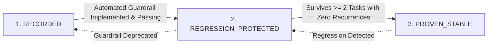
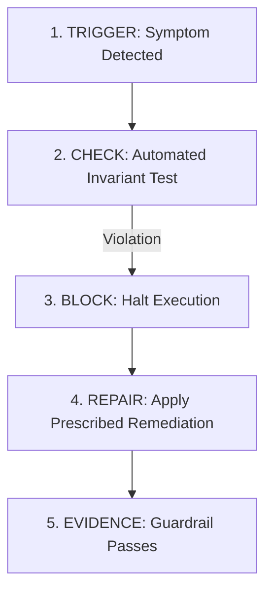

# Ocean Sentinel Agent Governance & Institutional Memory Specification

**Document Version:** 1.0.0  
**Effective Date:** 2026-09-15  
**Authoritative Machine Companion:** `data/metadata/ocean_sentinel_agent_governance_v1.json`  
**Learning Registry:** `data/metadata/ocean_sentinel_lessons_learned_v1.json`  
**Preflight Engine:** `scripts/agent_governance_preflight.py`  
**Governance Standard:** Level 5 Machine-Verifiable Operational Governance  

---

## 1. Executive Purpose & Mission

Ocean Sentinel is a long-term scientific Earth observation and maritime intelligence platform designed for multi-scale, multi-phenomenon oceanographic analysis using synthetic aperture radar (SAR). It is **not merely an oil spill classifier or a quick benchmark-tuning project**.

Over generations of investigations (from C15 through C22-J and DIAG-03), significant scientific and procedural lessons were discovered. However, when lessons are stored only in narrative reports or ephemeral chat context, identical failure patterns recur across subsequent agent sessions.

The **Ocean Sentinel Agent Governance System** provides an immutable, durable, repository-level institutional memory. It ensures that:
1. Future agents retrieve relevant prior lessons **before** drafting implementation plans.
2. Narrative claims cannot override machine truth.
3. Every critical rule is backed by an automated, executable regression test.
4. Lessons progress through rigorous, evidence-backed verification states.
5. Ocean Sentinel's long-term scientific integrity and physical data contracts remain strictly preserved.

---

## 2. Core Governance Tenet

> [!IMPORTANT]
> **The Machine-Enforcement Principle**: A lesson is **NEVER** considered learned simply because an agent has written it in a markdown report, acknowledged it in chat prose, or summarized it in a planning document. A lesson is learned only when an automated, machine-executable test or preflight check actively detects and prevents that failure from recurring.

---

## 3. The Three Learning States

To distinguish unverified documentation from hardened invariants, every lesson in the repository is classified into exactly one of three explicit learning states:



### 1. `RECORDED`
- **Definition**: The failure mode, anomaly, or epistemic drift has been catalogued in the lessons registry (`data/metadata/ocean_sentinel_lessons_learned_v1.json`), but no automated pytest or preflight block yet exists to prevent recurrence.
- **Operational Effect**: The preflight system flags the lesson as an **INFORMATIONAL WARNING**. The agent must manually review the failure pattern during planning.
- **Promotion Requirement**: Implement an automated test in `tests/` or a preflight rule in `scripts/agent_governance_preflight.py` that actively checks the invariant.

### 2. `REGRESSION_PROTECTED`
- **Definition**: The lesson is backed by an explicit, automated guardrail or pytest suite that actively asserts the invariant against code, manifests, or audit JSON artifacts.
- **Operational Effect**: Guardrail tests execute during preflight and CI validation. Any violation immediately **BLOCKS** task execution.
- **Promotion Requirement**: Must survive execution across **at least two subsequent, independent task generations** without a single failure or recurrence, backed by documented entries in `validation_history`.

### 3. `PROVEN_STABLE`
- **Definition**: The preventive control has repeatedly survived multi-generational execution passes and regression suites without recurrence. It is treated as an immutable repository invariant.
- **Operational Effect**: Hardened rule. Any proposed modification to the underlying rule or any test regression triggers a **CRITICAL SYSTEM BLOCK**.
- **Promotion Requirement**: Cannot be assigned directly or prospectively. Requires documented historical evidence.

---

## 4. Mandatory Preflight Protocol

Before executing substantive code changes, training commands, data processing, or report authoring, every agent must execute the deterministic preflight script:

```bash
.venv\Scripts\python scripts/agent_governance_preflight.py --task-type <CATEGORY>
```

### Supported Task Categories
- `diagnostic`: Data support, radiometry, receptive field, or gradient diagnostics without model training.
- `training`: Model training, pretraining, or optimization experiments under frozen protocol contracts.
- `evaluation`: Benchmark scoring, checkpoint evaluation, or validation split inference.
- `data_processing`: Dataset tiling, aggregation, filtering, or manifest generation.
- `documentation`: Authoring scientific reports, walkthroughs, or architectural specifications.
- `artifact_repair`: Forensic repair or reconciliation of audit JSON files.
- `repository_governance`: Updating lessons learned, regression test suites, or governance metadata.

### Preflight Performance Guarantee
- **Target Runtime**: Strictly **< 5 seconds**.
- **Design**: Performs fast, targeted static checks, manifest hash validations, and metadata queries. It does not scan entire image archives, access GPU compute, or launch heavy computation.

---

## 5. Hard Blockers (Zero-Tolerance Violations)

The preflight engine will issue an immediate **BLOCK** (exit code 1) under any of the following conditions:

| Blocker ID | Failure Condition | Preflight Action |
| :--- | :--- | :--- |
| `BLOCK-001-HOLDOUT` | Proposing or executing access to `HOLDOUT` partition (`data/ops02/tiles/holdout`). | **BLOCKS EXECUTION**. HOLDOUT is quarantined. |
| `BLOCK-002-PART_III` | Proposing or executing access to Part III evaluation data or predictions. | **BLOCKS EXECUTION**. Part III is strictly firewalled. |
| `BLOCK-003-DIAG_COLLISION`| Proposing a new diagnostic using an existing investigation ID (e.g. DIAG-01, DIAG-02, DIAG-03). | **BLOCKS EXECUTION**. Unique IDs required. |
| `BLOCK-004-CAUSAL_OVERCLAIM` | Using causal verbs ("causes", "drives", "explains", "root cause", "radiometric bottleneck") on observational/descriptive data. | **BLOCKS EXECUTION**. Requires calibrated non-causal language. |
| `BLOCK-005-PROTOCOL_MUTATION`| Mutating frozen canonical preprocessing (`INV-06`: $\mu=4.424158, \sigma=0.469261$) during diagnostics. | **BLOCKS EXECUTION**. Preprocessing is immutable. |
| `BLOCK-006-UNAUTHORIZED_TRAINING`| Invoking PyTorch backward passes, optimizer steps, or GPU allocations during diagnostic tasks. | **BLOCKS EXECUTION**. Diagnostic governance counters must be 0. |
| `BLOCK-007-DESTRUCTIVE_GIT`| Proposing destructive git commands (`git reset --hard`, `git clean`, `git checkout -f`, `git push --force`). | **BLOCKS EXECUTION**. Working-tree modifications must be preserved. |
| `BLOCK-008-DEPRECATED_TERMINOLOGY`| Using forbidden synonyms (calling OF an "oil spill", or HM a "vessel", "ship", or "Heavy Metal"). | **BLOCKS EXECUTION**. Canonical terminology enforced. |
| `BLOCK-009-PSEUDO_REPLICATION`| Treating pixel counts ($N > 10^6$) as independent degrees of freedom for statistical inference. | **BLOCKS EXECUTION**. Cluster-level bootstrap required. |
| `BLOCK-010-UNVERIFIED_PROVEN_STABLE`| Setting lesson status to `PROVEN_STABLE` without $\ge 2$ documented task validation passes. | **BLOCKS EXECUTION**. Unsubstantiated promotion rejected. |
| `BLOCK-011-PREFLIGHT_BYPASS`| Substantive operations or completion claim without a valid passing preflight receipt. | **BLOCKS EXECUTION**. Must run preflight and generate verified receipt. |
| `BLOCK-012-UNVERIFIED_TELEMETRY`| Telemetry claiming COMPLETE with active blockers, incomplete tests, or non-zero governance counters. | **BLOCKS COMPLETION**. All governance gates must be verified. |

---

## 6. Pattern-Level Prevention Architecture

To eliminate repeated rediscovery of known failure modes, recurring patterns are governed by the **Trigger-Check-Block-Repair-Evidence** schema:



### Core Prevention Patterns
1. **Causal Overclaims from Descriptive Data (`FP-006`)**:
   - *Trigger*: Text contains "causes", "drives", "explains", "radiometric bottleneck", "root cause".
   - *Check*: Is there a randomized or controlled causal experimental design?
   - *Block*: Reject narrative claim.
   - *Repair*: Rewrite using "observed", "associated with", "consistent with", or "HYPOTHESIZED".
   - *Evidence*: `test_exp07_p0_diag03_radiometric_guardrails.py::test_no_causal_overclaims` passes.
2. **Pixel-Level Pseudo-Replication (`FP-010`)**:
   - *Trigger*: Computing standard errors or p-values treating pixel counts ($N > 10^6$) as independent samples.
   - *Check*: Are observations clustered by parent acquisition scene?
   - *Block*: Reject statistical claims treating pixels as independent replicates.
   - *Repair*: Compute uncertainty via parent-cluster block bootstrap ($B \ge 1000$).
   - *Evidence*: `test_exp07_p0_diag03_radiometric_guardrails.py::test_bootstrap_and_pseudo_replication_safeguards` passes.
3. **Circular Tail-Mass Validation (`FP-009`)**:
   - *Trigger*: Asserting zero omitted tail mass after renormalizing discretized densities over an arbitrary grid.
   - *Check*: Measure empirical mass outside grid boundaries before any normalization.
   - *Block*: Reject support grid if omitted mass $\ge 10^{-4}$ for any class.
   - *Repair*: Dynamically expand support bounds until omitted empirical mass is $< 10^{-4}$.
   - *Evidence*: `test_exp07_p0_diag03_radiometric_guardrails.py::test_numerical_safeguards` passes.
4. **Diagnostic ID Collisions (`FP-005`)**:
   - *Trigger*: Reusing an existing diagnostic ID for a new question.
   - *Check*: Verify candidate ID against canonical roadmap registry.
   - *Block*: Reject execution plan.
   - *Repair*: Assign next sequential diagnostic ID (e.g. DIAG-06, etc.).
   - *Evidence*: `test_exp07_p0_c22j_diag02_forensic_guardrails.py::test_lesson_c22j_004_roadmap_integrity` passes.
5. **Preflight Bypass Prevention (`FP-015`)**:
   - *Trigger*: Task execution or completion claimed without unexpired, authentic preflight receipt.
   - *Check*: Cryptographic verification of `scratch/agent_governance_preflight_receipt.json`.
   - *Block*: Reject task completion claim.
   - *Repair*: Execute `python scripts/agent_governance_preflight.py --task-type <TYPE>` to generate receipt.
   - *Evidence*: `test_ocean_sentinel_agent_governance.py::test_preflight_receipt_generation_and_verification` passes.
6. **Paraphrased Causal Evasion Prevention (`FP-016`)**:
   - *Trigger*: Text uses semantic paraphrases ("accounts for poor mIoU", "primary driver of failure", "dictates performance", "proves spatial context is required") on observational data.
   - *Check*: Multi-pattern regex scanner in preflight engine.
   - *Block*: Reject plan or report.
   - *Repair*: Calibrate language to non-causal observational descriptions ("is associated with", "consistent with", "HYPOTHESIZED").
   - *Evidence*: `test_ocean_sentinel_agent_governance.py::test_causal_paraphrase_rejection` passes.

---

## 7. Canonical Roadmap Integrity

The sequence and scope of diagnostic investigations are strictly frozen. Future tasks cannot alter this order or repurpose completed investigations:

1. **`DIAG-01`**: Class Support & Metric Sensitivity  
   *Status*: **COMPLETED** (Closed as `CASE B`: Structural multi-label ambiguity confirmed).
2. **`DIAG-02`**: Sampler Exposure & Schedule Invariance  
   *Status*: **COMPLETED** (Closed as `REPAIRED`: Scale disparity and boundary truncation documented; starvation hypothesis bounded).
3. **`DIAG-03`**: Radiometric Feature Discriminability  
   *Status*: **COMPLETED** (Closed: Moderate 1-D overlap documented; substantial scene-level heterogeneity observed).
4. **`DIAG-04`**: Receptive Field & Spatial Scale Compatibility  
   *Status*: **RECOMMENDED NEXT CANDIDATE** (Unexecuted; requires explicit, separate execution authorization).
5. **`DIAG-05`**: Loss Landscape & Gradient Dynamics  
   *Status*: **DESIGN ONLY** (Not executed; strictly deferred until spatial scale is characterized).

---

## 8. Diagnostic Planning Gate (Requirements for Future Plans)

Every future diagnostic implementation plan must explicitly declare:
```yaml
diagnostic_id: "DIAG-XX"
scientific_question: "Exact, bounded question being investigated"
primary_measurement: "Physical quantity or empirical metric measured"
independent_unit: "Parent acquisition cluster (never unclustered pixels)"
authorized_partitions: ["TRAIN", "DEV"]
forbidden_partitions: ["HOLDOUT", "PART_III"]
primary_metric: "Primary statistical estimator"
secondary_metrics: ["Robust non-parametric secondary estimators"]
causal_scope: "DESCRIPTIVE_ONLY | CAUSAL_INTERVENTION"
expected_artifacts: ["Path to markdown report", "Path to Level 5 audit JSON"]
governance_counters:
  training_steps: 0
  backward_passes: 0
  optimizer_steps: 0
  gpu_seconds: 0.0
reproducibility_controls: "Fixed RNG seeds, deterministic support bounds, frozen normalization"
known_failure_patterns: ["FP-001", "FP-006", "FP-010"]
applicable_lessons: ["LL-EXP07-001", "LL-C22J-001", "LL-DIAG03-003"]
```

---

## 9. Conflict Resolution & Supersession Rules

If new empirical evidence challenges an earlier lesson or rule:
1. **Never Silently Overwrite**: Historical lesson records and audit JSON artifacts must remain immutable.
2. **Explicit Relationships**: Update the lesson metadata using formal relationships:
   - `SUPERSEDES`: Current lesson replaces an earlier understanding.
   - `SUPERSEDED_BY`: Earlier lesson points to the newer, more accurate finding.
   - `AMENDS`: Extends or refines an existing lesson's scope without invalidating it.
   - `DEPRECATED`: Inactive due to changes in dataset or model architecture.
3. **Hierarchical Authority**: In any discrepancy between narrative prose and Level 5 machine-readable JSON artifacts, the Level 5 machine JSON governs.

---

## 10. Long-Term Ocean Sentinel Scientific Principles

To prevent short-term metric gaming from corrupting long-term research goals:
- **Maritime Intelligence First**: The platform recognizes complex marine dynamics (ocean fronts, slicks, convection cells, internal waves, atmospheric fronts), not merely oil slicks.
- **Physical Context Matters**: Scene heterogeneity (wind field, surface roughness, incidence angle) must be accounted for rather than treated as simple noise.
- **Evidence Provenance**: All quantitative conclusions must trace back to immutable, cryptographically hashed dataset manifests.

---

## 11. Lesson Architecture v2: Institutional Learning & Operational Memory

Starting in Phase EXP-07, the governance framework incorporates **Lesson Architecture v2** (detailed in [`docs/LESSON_ARCHITECTURE_V2.md`](docs/LESSON_ARCHITECTURE_V2.md) and backed by machine metadata in `data/metadata/governance_v2/`).

### Normalized Entity Model
Rather than storing lessons as monolithic narrative records, v2 decomposes institutional knowledge into seven distinct relational entities:
1. **Principle** (`PRIN-xxx`): Foundational scientific or engineering invariants (e.g. `PRIN-001` Machine Truth Governs, `PRIN-002` Post-Transformation Support Invariance).
2. **Failure Class**: Controlled taxonomy of 28 error classes (e.g. `POPULATION-CONSTRUCTION`, `STATISTICAL-PROVENANCE`, `DENOMINATOR-DRIFT`).
3. **Incident** (`INC-xxx`): Concrete historical occurrences with documented root causes, impacts, detections, corrections, and associated rules.
4. **Lesson** (`LL-xxx`): Durable knowledge extracted from historical incidents.
5. **Rule** (`GOV-RULE-xxx`, `BLOCK-xxx`): Actionable, enforceable prevention requirements with explicit scope and severity.
6. **Assumption** (`ASSUMP-xxx`): Active operational assumptions tracked across `VERIFIED`, `UNVERIFIED`, and `CONTRADICTED` states.
7. **Validation History**: Immutable ledger of independent, multi-task validation passes required for `PROVEN_STABLE` promotion.

### Hybrid Retrieval & Precedence Engine
- **Hybrid Retrieval**: Combines exact ID matching, trigger pattern regex scanning, structured scope filtering (task type, experiment, diagnostic, domain, operation), and lexical keyword search. Every surfaced lesson provides an explicit `relevance_reason`.
- **Precedence & Conflict Policy**: `CRITICAL` global non-overridable rules can never be overridden by local task allowances. Conflicting directives trigger explicit `BLOCK-CONFLICT-001` blocks requiring human/agent review; never "last record wins".
- **Novelty Detection**: Classifies incoming tasks into `NOVEL`, `POTENTIALLY_NOVEL`, `KNOWN_BUT_UNPROTECTED`, or `KNOWN`.

### Invoking v2 Preflight
Future agents can invoke v2 preflight directly:
```bash
# Structured plan evaluation
.venv\Scripts\python scripts/agent_governance_preflight.py --v2 --task-type diagnostic --plan-text "Plan description"

# Interactive hybrid retrieval across lessons and rules
.venv\Scripts\python scripts/agent_governance_preflight.py --query-lessons "wilcoxon method binding"
```

---

## 12. Agent Execution Invariants & Operational Failure Handling (Phases 6–7 Lessons)

To prevent recurrent anti-patterns and maintain epistemic integrity across development generations, all agents must adhere to these durable operational rules:

1. **Epistemic Authority**: Live repository bytes, physical files, and raw Git state outrank old reports, AI narratives, and historical conversation summaries.
2. **Historical Snapshot Preservation**: Historical reports and milestone records must remain intact as immutable audit lineage. Do not retroactively rewrite historical documents to match current state; mark them explicitly as historical snapshots.
3. **Current-State Anti-Staleness**: Never persist volatile or mutable runtime identifiers (such as current Git HEAD SHA or dynamic test counts) as static current-state assertions without explicit derivation or snapshot qualification.
4. **External AI Evidence Quarantine**: Declared external AI sources (`AI-SRC-014`–`AI-SRC-017`) are unavailable and unverified. Never simulate, reconstruct, or assert unverified historical conversations. `AI-SRC-008` remains formally superseded.
5. **Consolidate Defects Before Repair**: Execute `SCAN -> CONSOLIDATE -> FIX -> VERIFY -> STOP`. Address all identified defects in a single consolidated pass. Maximum two repair attempts per run.
6. **Hard Stop On Proof**: When automated verification proves that the material issue is solved, stop immediately. Do not trigger endless audit or reconciliation loops.
7. **Technical vs. Documentation Drift**: Distinguish concrete code defects from documentation drift. Never modify functional code when resolving documentation or reporting discrepancies.
8. **Deterministic Stream Testing**: Long-lived Server-Sent Events (SSE) and asynchronous generators must be tested using streaming clients (`client.stream()` or explicit iteration). Never use synchronous requests (`client.get()`) that block waiting for EOF on non-terminal streams.
9. **Durable Write Order & Broadcast Suppression**: Canonical state update precedes durable append; durable append strictly precedes `EventBus` broadcast. A durable persistence failure must fail closed and suppress event broadcast to prevent phantom events.
10. **Subscriber Overflow Resynchronization**: In-process event pub/sub queues must remain bounded. When a subscriber queue overflows, the subscriber must set an overflow indicator and automatically resynchronize from the durable disk log starting from the highest received sequence.
11. **Observability Firewall**: Events and telemetry represent historical execution observation, never authorization. `EXECUTION_AUTHORIZED = False` remains fail-closed regardless of event generation.
12. **Targeted Concurrency Probes**: Use brute force only where exhaustive enumeration is formally required. For concurrency, races, and handoffs, use deterministic test hooks and targeted probes rather than random delays or keepalive timeouts.
13. **Bounded Task Execution & Diagnostics**: A task or test exceeding its historical runtime envelope by orders of magnitude is an immediate diagnostic signal of a deadlock, unclosed stream, or blocked loop. Terminate the hung process, diagnose the exact blocked line, and apply the minimal fix. Never wait indefinitely.
