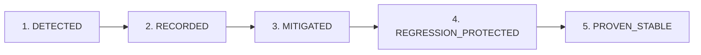

# Ocean Sentinel Agent Learning & Failure-Prevention Framework

**Document Version:** 1.0.0  
**Effective Date:** 2026-09-14  
**Authoritative Machine Registry (Legacy v1 Baseline):** `data/metadata/ocean_sentinel_lessons_learned_v1.json` *(Subordinate historical registry; canonical authority is `data/metadata/governance_v2/lessons.json`)*  
**Governance Standard:** Level 5 Machine-Verifiable Operational Governance  

---

## 1. Executive Mission & Purpose

The Ocean Sentinel system operates in high-stakes scientific Earth observation and machine learning domains where subtle errors—such as taxonomy drift, unverified baseline numbers, conflation of source and dense labels, or unverified RNG seeds—can distort multiple generations of experimental conclusions.

Historically, corrective insights were documented in markdown reports, only for identical failure patterns to recur in subsequent tasks. The **Agent Learning & Failure-Prevention Framework** transforms recurring agent failures from repeated documentation problems into **machine-enforced regression tests**.

> [!IMPORTANT]
> **Core Tenet:** A lesson is **NEVER** considered "learned" merely because an agent has written it down or acknowledged it in prose. A lesson is learned only when an automated, machine-executable test exists that actively blocks that failure from recurring.

---

## 2. The Five-Stage Lesson Lifecycle

Every discovered issue progresses through a formal five-stage lifecycle:

1. **`DETECTED`**:
   - An anomaly, discrepancy, epistemic overclaim, or process drift is identified during preflight, execution, or post-audit.
2. **`RECORDED`**:
   - The failure pattern is formally catalogued in an incident register and assigned a permanent identifier (`LL-EXP07-XXX`), root cause, severity, and category.
3. **`MITIGATED`**:
   - The immediate artifact or code containing the error is repaired, establishing correct Level 5 machine truth.
4. **`REGRESSION_PROTECTED`**:
   - A permanent preventive control is defined, and an **automated test** is implemented in the test suite. Future relevant tasks can run this test to verify the invariant.
5. **`PROVEN_STABLE`**:
   - The regression test has passed across multiple subsequent task generations without a single recurrence of the failure pattern.

---

## 3. Lesson Schema & Classification

Each entry in `data/metadata/ocean_sentinel_lessons_learned_v1.json` conforms to the following strict schema:

| Field Name | Type | Description |
|---|---|---|
| `lesson_id` | `string` | Unique identifier (e.g. `LL-EXP07-001`) |
| `category` | `enum` | One of the 7 core failure categories below |
| `failure_pattern` | `string` | Short, descriptive title of the failure mode |
| `description` | `string` | Detailed narrative of how the failure manifested |
| `root_cause` | `string` | Underlying systemic or procedural cause |
| `first_seen` | `string` | Task ID where first identified (e.g. `EXP-07-P0-C15`) |
| `last_seen` | `string` | Most recent task where observed |
| `occurrence_count` | `int` | Number of recorded occurrences |
| `severity` | `enum` | `LOW`, `MEDIUM`, `HIGH`, `CRITICAL` |
| `affected_tasks` | `list[string]`| Historical tasks impacted |
| `detection_method`| `string` | How the failure is automatically detected |
| `prevention_method`| `string`| Operational governance control preventing it |
| `required_preflight`| `string`| Function or check required before proceeding |
| `regression_test`| `string` | Exact pytest path to the regression test |
| `status` | `enum` | One of the 5 lifecycle states |
| `notes` | `string` | Contextual background or incident references |

### Failure Categories
1. **`SCIENTIFIC_VALIDITY`**: Causal overclaims, unsupported generalizations, baseline metric inflation, ungrounded hypotheses.
2. **`DATA_INTEGRITY`**: Conflating source and dense labels, version ambiguity, mask or partition corruption.
3. **`REPRODUCIBILITY`**: RNG drift, sample schedule divergence, checkpoint lineage breaks, initialization state mismatch.
4. **`IMPLEMENTATION_INTEGRITY`**: Serialization bugs, tensor shape mismatches, loss reduction semantics.
5. **`DOCUMENTATION_INTEGRITY`**: Taxonomy drift, terminology confusion, imprecise acronyms.
6. **`OPERATIONAL_SAFETY`**: Partition firewall breaches (HOLDOUT access, Part-III access), unauthorized training.
7. **`AGENT_PROCESS`**: Confusing test passage with universal bug-freedom, editing files without testing.

---

## 4. Initial Seed Lesson Catalog (Summary)

The framework is initialized with 20 foundational lessons derived from empirical project incidents:

- **`LL-EXP07-001`**: Narrative claims overriding machine truth (INC-C20-001, INC-C20-004).
- **`LL-EXP07-002`**: Taxonomy and terminology drift across iterations.
- **`LL-EXP07-003`**: Source-label vs dense-index confusion (conflating source labels 3, 9, 14 with dense classes).
- **`LL-EXP07-004`**: Historical vs current dataset identity confusion (INC-C20-002).
- **`LL-EXP07-005`**: Protocol hyperparameter drift across iterations.
- **`LL-EXP07-006`**: Incorrect sampler seed formulation (static seed vs epoch formula).
- **`LL-EXP07-007`**: Incorrect input-shape documentation (omitting singleton channel dimension).
- **`LL-EXP07-008`**: Unsupported causal inference from descriptive evidence (INC-C20-005).
- **`LL-EXP07-009`**: Interpreting 'tests passed' as '100% bug-free' (INC-C20-006).
- **`LL-EXP07-010`**: Unverified historical performance baselines (0.4072 vs 0.1190).
- **`LL-EXP07-011`**: Normalization conclusions generalized beyond observed evaluations.
- **`LL-EXP07-012`**: Loss-weight terminology confusion (sqrt-median vs inverse-frequency).
- **`LL-EXP07-013`**: Arbitrary experimental thresholds (heuristic cutoffs without empirical basis).
- **`LL-EXP07-014`**: Incomplete checkpoint lineage (lacking SHA-256 and script hashes).
- **`LL-EXP07-015`**: Pretrained-weight identifier suffix mistaken for cryptographic hash.
- **`LL-EXP07-016`**: Failure to verify exact initial model state (cloning full architecture state dict).
- **`LL-EXP07-017`**: Assuming same seed integer guarantees execution parity.
- **`LL-EXP07-018`**: Failure to enforce sample schedule parity (runtime sampler drift).
- **`LL-EXP07-019`**: Failure to distinguish sample count (132 tiles) from independent parent count (40 TRAIN parent datatakes / 64 total).
- **`LL-EXP07-020`**: Repeated correction without automated recurrence protection.
- **`LL-EXP07-021`**: Derived statistic drift and semantic ambiguity in dataset totals (8,595,330 vs 8,401,060).
- **`LL-EXP07-022`**: Treating degenerate model performance (e.g. background-collapse) as an automatic pipeline failure.
- **`LL-EXP07-023`**: Conflating decimal rounding residuals with floating-point machine epsilon.

---

## 5. Efficiency & Execution Policy

To maintain agility without compromising rigor, future tasks must apply the **Selective Verification Principle**:

### Use Smart (Static) Verification For:
- JSON metadata schemas and provenance lineages.
- Cryptographic hash checks of frozen manifests and scripts.
- Terminology and forbidden-pattern regular expression scans.
- Static parameter equality checks against locked protocol JSONs.

### Use Brute-Force (Dynamic) Verification For:
- Full-model state dictionary tensor-level equality.
- Bitwise sample schedule and batch ID matching.
- Exact control and treatment loss vector evaluations.
- Physical firewall boundaries (verifying zero read calls to HOLDOUT).

### Avoid Expensive Compute When:
- A deterministic static check answers the identical question. Never execute GPU inference or full training runs simply to verify that a configuration parameter is set correctly.

---

## 6. Interaction Protocol for Future Tasks

When an agent begins a new task in Ocean Sentinel:
1. **Preflight Step:** Load `data/metadata/ocean_sentinel_lessons_learned_v1.json`.
2. **Filter Relevant Lessons:** Identify lessons whose `category` or `required_preflight` relates to the current task scope.
3. **Execute Relevant Checks:** Run the designated regression tests in `tests/test_ocean_sentinel_agent_learning_framework.py` and task-specific guardrail files.
4. **On New Failure:** If a novel issue arises, do not merely patch the text. Add a new lesson record, write a regression test, and transition the status to `REGRESSION_PROTECTED`.
