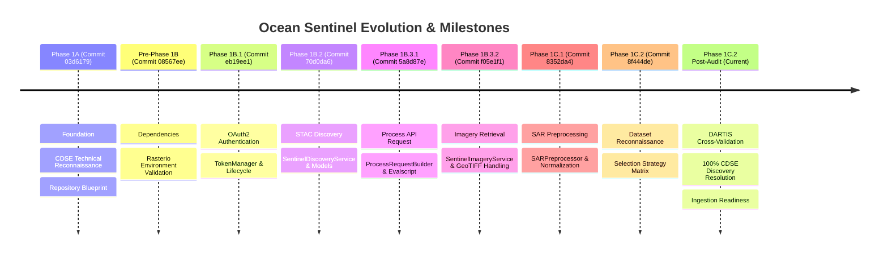

# Ocean Sentinel — Implementation History & Milestone Log

**Document Version**: 1.0.0  
**Status**: ACTIVE / CHRONOLOGICAL LOG  
**Date**: September 2026  
**Repository**: `D:\Projects\ocean-sentinel`  
**Primary Sources**: Git commit log, phase walkthrough documents, implementation reports  

---

## 1. Milestone Chronology

---

## 2. Detailed Phase Summaries

### Phase 1A: Project Foundation & Architecture Blueprint `[VERIFIED]`
* **Commit**: `03d6179`
* **Deliverables**:
  - Initial repository layout: `src/ocean_sentinel`, `tests`, `docs`, `scripts`.
  - Base configuration framework using `pydantic-settings`.
  - Core domain models: `BoundingBox`, `TimeRange`, `SearchRequest`, `AcquisitionMetadata`.
  - Error hierarchy: `OceanSentinelError` and specialized subclasses.
  - Comprehensive architectural documentation (`docs/architecture.md`, `docs/configuration.md`).
  - Architectural Decision Record: `docs/adr/001-copernicus-stac-sentinelhub.md`.

### Pre-Phase 1B: Dependency Realignment & Rasterio Environment `[VERIFIED]`
* **Commit**: `08567ee`
* **Deliverables**:
  - Reconciled GDAL / Rasterio C-library binary wheel dependencies on Windows.
  - Added `test_raster_env.py` verifying Rasterio in-memory GeoTIFF decoding, GDAL drivers, and affine transforms.

### Phase 1B.1: Copernicus OAuth2 Authentication `[VERIFIED]`
* **Commit**: `eb19ee1`
* **Deliverables**:
  - `TokenManager` class in `src/ocean_sentinel/satellite/auth.py`.
  - Implementation of OAuth2 Client Credentials flow against CDSE identity endpoint.
  - Thread-safe token caching, expiry tracking, and proactive renewal.
  - Standalone verification script: `scripts/verify_auth.py`.
  - 37 unit tests covering authentication flows, token expiration, caching, and error handling.

### Phase 1B.2: Sentinel-1 STAC Discovery Service `[VERIFIED]`
* **Commit**: `70d0da6`
* **Deliverables**:
  - `SentinelDiscoveryService` in `src/ocean_sentinel/satellite/discovery.py`.
  - CDSE STAC API integration querying collection `sentinel-1-grd`.
  - Normalization of STAC JSON items into internal `AcquisitionMetadata`.
  - Pagination, query throttling, and HTTP error translation.
  - Standalone verification script: `scripts/verify_stac.py`.
  - 37 unit tests covering spatial-temporal query construction and STAC item parsing.

### Phase 1B.3.1: Sentinel-1 Process API Request Construction `[VERIFIED]`
* **Commit**: `5a8d87e`
* **Deliverables**:
  - `ProcessRequestBuilder` in `src/ocean_sentinel/satellite/imagery.py`.
  - Custom dynamic evalscript generating float32 linear $\sigma^0$ output for requested polarizations (`VV`, `VH`).
  - Spatial bounding box and coordinate reference system (CRS) translation.
  - 69 unit tests validating request serialization, polarization validation, and evalscript structure.

### Phase 1B.3.2: Sentinel-1 Imagery Retrieval & GeoTIFF Validation `[VERIFIED]`
* **Commit**: `f05e1f1`
* **Deliverables**:
  - `SentinelImageryService` in `src/ocean_sentinel/satellite/imagery.py`.
  - Execution of HTTP POST requests to Sentinel Hub Process API with Bearer token authentication.
  - In-memory decoding of returned GeoTIFF rasters via `rasterio.io.MemoryFile`.
  - Dimension, CRS, and band count validation, plus finite statistics calculation (`BandStatistics`).
  - Standalone verification script: `scripts/verify_imagery.py`.
  - 32 unit tests validating retrieval, HTTP mock interactions, raster decoding, and error recovery.

### Phase 1C.1: SAR Preprocessing & Scientific Pipeline `[VERIFIED]`
* **Commit**: `8352da4`
* **Deliverables**:
  - `SARPreprocessor` in `src/ocean_sentinel/processing/sar.py`.
  - Domain models in `src/ocean_sentinel/processing/models.py` (`PreprocessingConfig`, `PreprocessingResult`, `PreprocessedBand`, `PreprocessedBandStats`, `QualityMetrics`).
  - Deterministic validity masking: identifies non-positive, NaN, or infinite pixels.
  - Numerically safe linear $\sigma^0 \to \text{dB}$ conversion ($10 \log_{10}$) with configurable floor ($-50.0\text{ dB}$).
  - Multi-method normalization: Percentile ($1\% - 99\%$, clipped to $[0, 1]$), Min-Max, Z-score.
  - Multi-channel 3D array stacking (`to_multichannel_array()`).
  - Standalone verification script: `scripts/verify_preprocessing.py`.
  - 27 unit tests validating mathematical transformations, statistics, and normalization.

### Phase 1C.2: Oil-Spill Dataset Reconnaissance & Strategy `[VERIFIED]`
* **Commit**: `8f444de`
* **Deliverables**:
  - Comprehensive survey of international open-science SAR oil spill datasets (`docs/dataset-reconnaissance.md`).
  - Tripartite selection strategy: Trujillo-Acatitla Part I (training backbone), Yang & Singha / DARTIS (lineage benchmark), Peruvian S1 (validation holdout) (`docs/dataset-selection.md`).
  - Host storage capacity profiling on drive `D:` (>480 GB free).

### Phase 1C.2 Post-Audit & Cross-Validation (Current Working Tree) `[VERIFIED]`
* **Deliverables**:
  - Dataset acquisition tool: `scripts/download_datasets.py` with URL whitelisting, HTTP Range resumption, and SHA256/MD5 validation.
  - Ingestion of DARTIS metadata table: `data/metadata/yang_singha_2025/data_matrix.tab` (5,515 rows, 1,181 unique Sentinel-1 scenes).
  - Ingestion & extraction of Trujillo Part I masks: `data/raw/trujillo_2024/masks/Mask_oil/` (exactly 1,200 TIFF masks, $2048 \times 2048$, binary).
  - Deterministic stratified CDSE discovery cross-validation (`scripts/verify_dartis_cdse.py`): Tested 40 scenes across 8 strata spanning Jan–Dec 2019; achieved 100% resolution against live CDSE STAC (0 bytes imagery downloaded).
  - Machine-readable audit report: `data/metadata/yang_singha_2025/cdse_validation_report.json`.
  - Comprehensive cross-validation document: `docs/dartis-cdse-cross-validation.md`.
  - Integration readiness audit: `docs/dataset-ingestion-readiness.md`.
  - Unit tests added: `tests/test_dartis_cross_validation.py` (6 unit tests, all passing; total test suite at 269 passing).\n