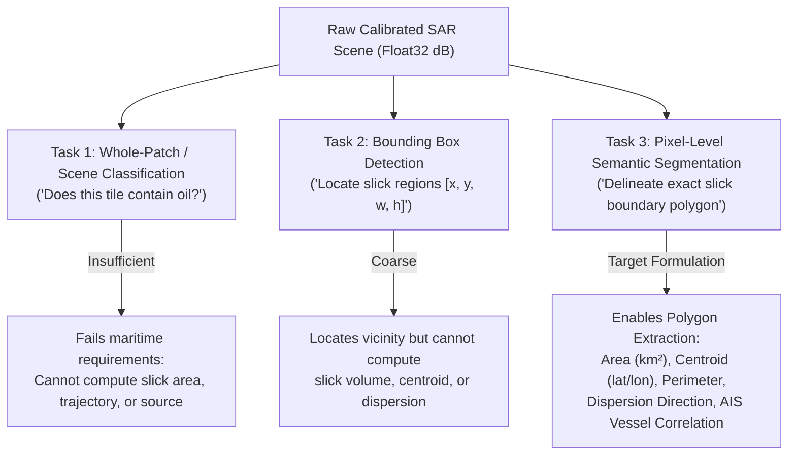
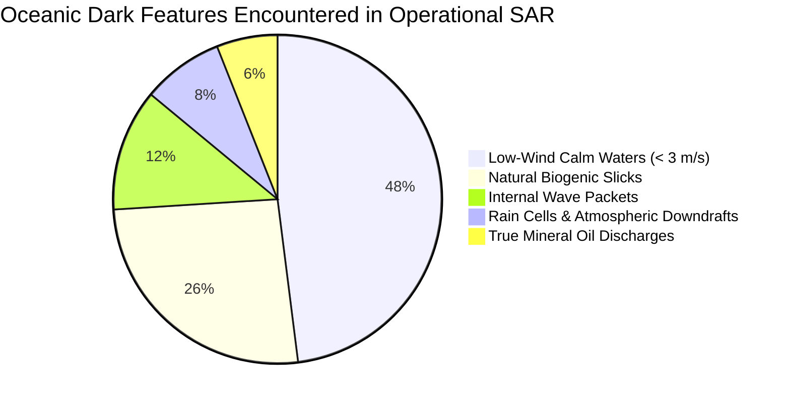
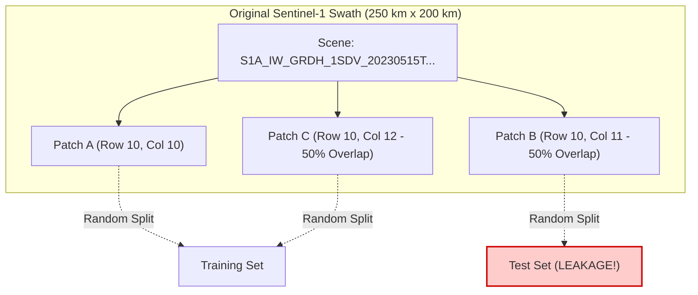
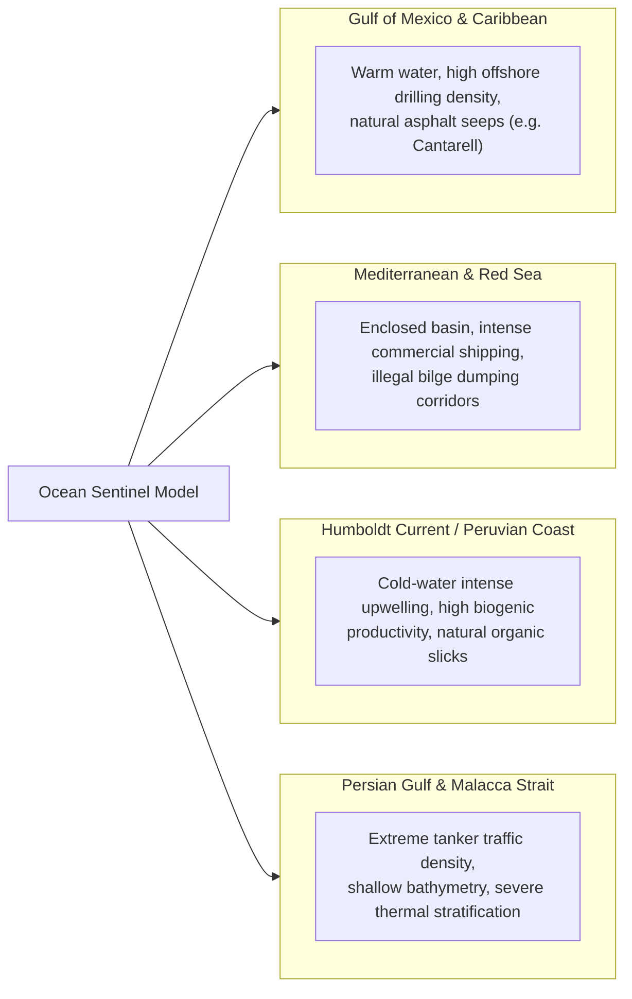
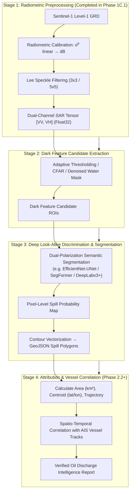

# Phase 1C.2 — Marine Oil-Spill SAR Dataset Reconnaissance & Selection Strategy

**Document Version**: 1.0.0  
**Status**: DRAFT / RECOMMENDATION FOR CAO REVIEW  
**Author**: Implementation Engineer (Ocean Sentinel Team)  
**Supervisor**: Chief Architect Officer (CAO)  
**Date**: September 2026  
**Target Repository**: `d:\Projects\ocean-sentinel`

---

## 1. Executive Conclusion

Ocean Sentinel requires high-quality, scientifically sound, georeferenced Sentinel-1 Synthetic Aperture Radar (SAR) training and validation data to bridge the gap between verified radiometric preprocessing (Phase 1C.1) and operational oil spill detection and polygon segmentation (Phase 2.0).

Following extensive reconnaissance across international open-science repositories (Zenodo, PANGAEA, arXiv, GitHub, NOAA, Copernicus, EMSA), the strategic conclusions are:

1. **Primary Training Dataset (Radiometric Segmentation)**: **Trujillo-Acatitla et al. (July 2024, IPICYT / Marine Pollution Bulletin)**
   - *Zenodo Record*: Part I (`10.5281/zenodo.8346860`), Part II (`10.5281/zenodo.8253899`), Part III (`10.5281/zenodo.13761290`).
   - *Technical Justification*: Direct 100% radiometric and structural parity with the Ocean Sentinel Phase 1C.1 pipeline (`SARPreprocessor`). Provides dual-polarization (VV + VH) $\sigma^0$ in decibels (dB), natively stored in floating-point GeoTIFF rasters with matched binary pixel-level segmentation masks ($2048 \times 2048$ native resolution). Explicitly includes dedicated subsets for true mineral oil spills, oceanic look-alikes, and clean water.

2. **Primary Benchmark & Metadata Cross-Reference Dataset**: **Yang & Singha / DARTIS Project (2024–2025, DLR / DMI / ESSD)**
   - *PANGAEA Record*: `10.1594/PANGAEA.980773`; Zenodo: `10.5281/zenodo.17789853`.
   - *Technical Justification*: Contains 1,365 oil patches (3,225 distinct spill objects) and 2,290 no-oil/look-alike patches in the Eastern Mediterranean. Crucially, it provides canonical Copernicus `Sentinel_ID` scene identifiers, precise timestamps, and geographic coordinates, enabling end-to-end trace validation through Ocean Sentinel's live `SentinelDiscoveryService` and `SentinelImageryService`.

3. **Independent Out-of-Domain Validation Benchmark**: **Peruvian Coastal Upwelling Dataset / MORP-Synth (Dec 2025, arXiv:2512.02290)**
   - *Zenodo Record*: `10.5281/zenodo.19258036`.
   - *Technical Justification*: Provides 2,112 labeled $512 \times 512$ patches from 40 Sentinel-1 scenes along the Pacific coast of Peru (Humboldt Current upwelling system). Serves as an independent out-of-domain benchmark to evaluate model robustness against natural upwelling look-alikes without spatial or regional data leakage.

4. **Storage & Execution Impact**:
   - Total immediate download footprint for recommended initial phase: **~42.4 GB** (Trujillo-Acatitla Part I + Yang & Singha PANGAEA subsets).
   - Fits comfortably within the available **484 GB** storage headroom on drive `D:`, leaving >85% free for runtime tiles, intermediate masks, and test outputs.
   - **Zero production code changes** and **zero premature ML dependency installations** in this phase. Downloads remain queued until CAO issues formal authorization.

---

## 2. Comprehensive Candidate Comparison Matrix

| Candidate Dataset | Primary Authors / Affiliation | Platform / Sensor | Polarizations | Radiometric Format | Image Resolution / Dimensions | Annotations & Classes | Total Volume & Count | Geographic Scope | Splitting Unit | License | Access Status |
| :--- | :--- | :--- | :--- | :--- | :--- | :--- | :--- | :--- | :--- | :--- | :--- |
| **Trujillo-Acatitla (2024)** | Trujillo-Acatitla et al. (IPICYT, Mexico) | Sentinel-1 C-SAR IW GRD | VV + VH | Calibrated $\sigma^0$ (dB), float32 | $2048 \times 2048$ GeoTIFF (10 m / 20 m pixel) | Binary segmentation masks (Oil Spill, Look-Alike, Clean Sea) | ~90 GB total (Part I: 37.9 GB, Part II: 42.8 GB, Part III: 9.2 GB); >3,000 scenes/tiles | Gulf of Mexico, Caribbean, Global | Tile / Scene (Split by Zenodo parts) | CC-BY 4.0 | Open Zenodo Direct Download |
| **Yang & Singha / DARTIS (2025)** | Yang & Singha (DLR / DMI, Germany) | Sentinel-1 C-SAR IW GRD | VV (+ VH metadata) | Calibrated $\sigma^0$ (dB / linear) & NetCDF | Variable patches + full scenes; XML polygons | 4 Subsets: Oil Coast (`oc`), Oil Water (`ow`), No-Oil Coast (`nc`), No-Oil Water (`nw`) | ~14.1 GB (PANGAEA archive); 1,365 oil patches, 2,290 no-oil patches | Eastern Mediterranean Sea | Scene / Acquisition ID lineage | CC-BY 4.0 | Open PANGAEA Direct Download |
| **Krestenitis et al. (2019)** | Krestenitis et al. (CERTH / ITI, Greece) | Sentinel-1 C-SAR IW GRD | VV | Processed 8-bit / float rasters (unstandardized) | $320 \times 320$ to $336 \times 336$ | 5 Classes: Sea, Oil spill, Look-alike, Ship, Land | ~1.5 GB; 1,002 patches from 68 scenes | Mediterranean, European Coasts | Random patch split (Known spatial leakage) | Academic (Restricted) | Gated / Email request only (3rd-party mirrors degraded) |
| **Peruvian S1 / MORP-Synth (2025)** | Andréx et al. (Univ. Nacional de San Agustín) | Sentinel-1 C-SAR IW GRD | VV + VH | Calibrated $\sigma^0$ (dB) GeoTIFF | $512 \times 512$ GeoTIFF | Binary pixel masks + morphological perturbations | ~3.2 GB; 2,112 patches from 40 scenes | Pacific Ocean (Peruvian Coast / Humboldt Current) | Scene-level / Cross-domain holdout | CC-BY 4.0 | Open Zenodo Direct Download |
| **SkyTruth Cerulean (Operational)** | SkyTruth / Global Fishing Watch | Sentinel-1 C-SAR IW GRD | VV + VH | Operational GeoTIFF via CDSE / GCS | Full swath / $512 \times 512$ sliding window | Bilge dump slicks, platform leaks, vessel tracks | Dynamic Cloud DB (>50,000 events); Code repo open | Global maritime corridors | Temporal / Incident based | Apache 2.0 (Code) / CC-BY-NC (Data) | API / BigQuery / Google Cloud Storage |
| **NOAA NESDIS SAB MPSR (Operational)** | NOAA Satellite Analysis Branch | Multi-mission (Sentinel-1, RADARSAT-2, RCM) | Multi-pol | Analyst Vector Polygons (GIS) | N/A (Shapefiles / KMZ vector boundaries) | Oil anomaly polygons, confidence, source type | ~500 MB (vectors only, imagery requires retrieval) | US Exclusive Economic Zone (EEZ), Gulf of Mexico | Event / Report ID | US Public Domain | Open NOAA Web / FTP Archive |
| **CleanSeaNet (Operational)** | European Maritime Safety Agency (EMSA) | Sentinel-1, RADARSAT, COSMO-SkyMed | Dual-pol / Single | Calibrated SAR rasters + alert reports | Variable operational scenes | Classified oil spill alerts, confidence ratings | Multi-terabyte restricted operational database | European waters | Operational stream | Proprietary / Confidential | Restricted to EU Member State Authorities |
| **Kaggle Oil Spill Mirrors (Various)** | Unverified uploaders | Unverified SAR / Optical | Monochromatic | 8-bit uint8 PNG / JPEG (Quantized) | $256 \times 256$ PNG | Binary or 5-class color-indexed masks | 100 MB – 2 GB | Mixed / Unspecified | Arbitrary random split | Varies / Unclear | Non-reproducible / Deficient for scientific SAR |

---

## 3. Detailed Candidate Records

### 3.1 Candidate 1: Trujillo-Acatitla et al. (July 2024)

* **Full Citation**: Trujillo-Acatitla, E. R., et al., *"Marine oil spill detection and segmentation in SAR data with two steps Deep Learning framework"*, *Marine Pollution Bulletin*, Vol. 204, 116549 (July 2024).  
* **DOI**: `10.1016/j.marpolbul.2024.116549`  
* **Repository Platform**: Zenodo (Open Science Archive)  
* **Zenodo Identifiers**:
  * Part I (Oil spill training/val rasters & masks): `10.5281/zenodo.8346860` (Files: `Oil_images.zip` [37.92 GB], `Oil_masks.zip` [5.8 MB]).
  * Part II (No-oil & Look-alike images/masks): `10.5281/zenodo.8253899` (Files: `NoOil_images.zip` [21.36 GB], `Lookalike_images.zip` [21.41 GB], `Lookalike_masks.zip` [6.3 MB]).
  * Part III (Independent test set): `10.5281/zenodo.13761290` (Files: `Test_images.zip` [9.18 GB], `Test_masks.zip` [1.2 MB]).
* **License**: Creative Commons Attribution 4.0 International (CC-BY 4.0).
* **Data Properties**:
  * *Sensor & Acquisition*: Sentinel-1 C-band SAR, Interferometric Wide (IW) swath, Ground Range Detected (GRD).
  * *Bands / Channels*: Dual-polarization VV + VH (2 channels per GeoTIFF).
  * *Radiometry*: Backscatter coefficient $\sigma^0$ expressed in decibels ($\text{dB}$), float32 precision. Matches Phase 1C.1 formula $\sigma^0_{\text{dB}} = 10 \cdot \log_{10}(\sigma^0_{\text{linear}} + \epsilon)$.
  * *Resolution*: $2048 \times 2048$ pixels per patch, preserved georeferenced spatial resolution (~10 m pixel spacing).
  * *Ground Truth Annotations*: Binary pixel segmentation masks ($0 = \text{background/ocean}$, $255 = \text{oil spill}$). Look-alike subset includes masks distinguishing dark surface natural phenomena from authentic petroleum slicks.
* **Compatibility with Ocean Sentinel Pipeline**: **100% Match**. Directly consumable by downstream tensors without radiometric re-encoding.
* **Limitations**: High file size (~90 GB combined). Selective download of Part I (37.9 GB) is recommended initially.

### 3.2 Candidate 2: Yang & Singha / DARTIS Project (2024–2025)

* **Full Citation**: Yang, Y. & Singha, S., *"Dataset of oil slicks, look-alikes and remarkable SAR signatures obtained from Sentinel-1 data in the Eastern Mediterranean Sea"*, *Earth System Science Data* (ESSD), 17(12), 6807–6837 (2025). DOI: `10.5194/essd-17-6807-2025`.  
  *Companion Reference*: Yang & Singha, *International Journal of Remote Sensing*, 45(6), 1957–1983 (2024), DOI: `10.1080/01431161.2024.2321468`.  
* **Repository Platform**: PANGAEA World Data Center & Zenodo  
* **Persistent Identifiers**:
  * PANGAEA Data Archive: DOI `10.1594/PANGAEA.980773`
  * Zenodo Code & Processing Scripts: DOI `10.5281/zenodo.17789853`
* **License**: Creative Commons Attribution 4.0 International (CC-BY 4.0).
* **Data Properties**:
  * *Sensor*: Sentinel-1A / Sentinel-1B IW GRD.
  * *Content*: 1,365 verified oil spill patches (containing 3,225 individual slick objects) and 2,290 look-alike / no-oil patches.
  * *Categorization Taxonomy*: Four systematically organized subsets:
    1. `oc` (Oil spill near Coastline)
    2. `ow` (Oil spill Open Water)
    3. `nc` (No-oil / Look-alike near Coastline)
    4. `nw` (No-oil / Look-alike Open Water)
  * *Annotation Types*: XML bounding boxes, polygon vertex coordinates, and binary mask rasters.
  * *Metadata Granularity*: **Unmatched**. Provides canonical Copernicus Sentinel-1 Product IDs (`Sentinel_ID`), precise acquisition timestamp, orbit direction (ascending/descending), relative orbit number, and geographic bounding boxes.
* **Compatibility with Ocean Sentinel Pipeline**: Extremely High. The metadata directly unlocks end-to-end integration testing: we can use Yang & Singha's `Sentinel_ID` list to run automated integration queries against our CDSE STAC Discovery service (`SentinelDiscoveryService`) and retrieve full scenes with `SentinelImageryService`.
* **Limitations**: Annotation format includes custom XML and NetCDF requiring an ingestion parser.

### 3.3 Candidate 3: Krestenitis et al. (2019)

* **Full Citation**: Krestenitis, M., et al., *"Oil Spill Detection from Sentinel-1 SAR Data Using Convolutional Neural Networks"*, *Remote Sensing*, 11(15), 1768 (2019).  
* **DOI**: `10.3390/rs11151768`  
* **Repository Platform**: CERTH / ITI / MMSPG (Academic Website / Gated)  
* **License**: Academic use only upon author approval.
* **Data Properties**:
  * *Scope*: ~1,002 image patches cut from 68 original Sentinel-1 scenes.
  * *Resolution*: $320 \times 320$ / $336 \times 336$ pixels.
  * *Classes (5-Class Semantic)*: (0) Sea Surface, (1) Oil Spill, (2) Look-alike, (3) Ship, (4) Land.
* **Critical Flaws & Limitations**:
  1. *Spatial Leakage*: Patches were randomly partitioned into train/test sets, meaning overlapping or contiguous patches cut from the exact same SAR scene exist in both training and test partitions.
  2. *Data Distribution Degradation*: The official download is gated. Third-party mirrors on GitHub and Kaggle have uniformly converted the original floating-point SAR backscatter into 8-bit unsigned integer (`uint8`) PNG images, completely destroying the physical calibration, decibel scale, and geospatial headers.
* **Verdict**: **REJECTED** for primary training; retain only as historical architectural reference.

### 3.4 Candidate 4: Peruvian S1 Oil Spill Dataset / MORP-Synth (Dec 2025)

* **Full Citation**: Andréx, A. et al., *"Enhancing Cross-Domain SAR Oil Spill Segmentation via Morphological Region Perturbation and Synthetic Label-to-SAR Generation"*, arXiv:2512.02290 (December 2025).  
* **DOI**: `10.48550/arXiv.2512.02290`  
* **Repository Platform**: Zenodo (ID `10.5281/zenodo.19258036`) & GitHub (`andrexandrex/MorpSynth`)  
* **License**: Creative Commons Attribution 4.0 International (CC-BY 4.0).
* **Data Properties**:
  * *Sensor*: Sentinel-1 IW GRD (2014–2024).
  * *Scope*: 2,112 curated $512 \times 512$ patches extracted from 40 raw Sentinel-1 scenes.
  * *Geographic Domain*: Peruvian Pacific coastline (dominated by intense Humboldt Current coastal upwelling, cold water advection, and the major January 2022 Repsol Callao refinery spill).
  * *Annotations*: Binary ground truth segmentation masks verified against national marine emergency records.
* **Compatibility with Ocean Sentinel Pipeline**: High. Standard GeoTIFF format with dual-polarization SAR backscatter.
* **Value Proposition**: **Benchmark of Choice for Cross-Domain Generalization**. Models trained on Mediterranean or Gulf of Mexico data historically suffer severe false-positive alarms when deployed over intense Pacific upwelling zones. MORP-Synth provides the ideal independent validation set.

### 3.5 Candidate 5: SkyTruth Cerulean Operational Pipeline

* **Full Citation**: SkyTruth Cerulean Project (Global Fishing Watch & ESA partner), 2023–2026.  
* **Code Repository**: `https://github.com/SkyTruth/cerulean-ml`  
* **API / Platform**: `api.cerulean.skytruth.org`  
* **License**: Apache 2.0 (code); CC-BY-NC (derived slick data).
* **Data Properties**:
  * Operational cloud pipeline ingesting global Sentinel-1 GRD imagery daily.
  * Detects vessel bilge dumping tracks and offshore drilling platform leaks using multi-task segmentation (Mask R-CNN / semantic FCN) coupled with Automatic Identification System (AIS) vessel trajectory coincidence.
* **Verdict**: **Operational Gold Standard & Validation Reference**. Not packaged as a monolithic static Zenodo download, but the open-source detection architecture, AIS-correlation rules, and public API polygon endpoints provide a direct blueprint for Ocean Sentinel's future Phase 2.2–2.4 (vessel attribution).

### 3.6 Candidate 6: NOAA NESDIS SAB Marine Pollution Surveillance Reports (MPSR)

* **Full Citation**: National Oceanic and Atmospheric Administration (NOAA) NESDIS Satellite Analysis Branch (SAB).  
* **Access Portal**: NOAA NESDIS Marine Pollution Surveillance Reports Archive.  
* **License**: U.S. Public Domain.
* **Data Properties**:
  * GIS shapefiles, KMZ layers, and PDF text bulletins published daily/weekly for US coastal waters.
  * Analyst-delineated slick polygons with expert confidence scores and source attribution (e.g., natural seep vs vessel discharge vs platform failure).
* **Verdict**: **Ground Truth Polygon Validation Source**. Contains no imagery itself, but polygon coordinates can be programmatically matched against historical Copernicus STAC scenes to generate verified test benchmarks.

### 3.7 Candidate 7: EMSA CleanSeaNet (European Maritime Safety Agency)

* **Description**: Operational oil spill monitoring and vessel detection service covering all European maritime zones.
* **Access**: Restricted strictly to authorized EU member state coast guards and maritime authorities under EU Directive 2005/35/EC.
* **Verdict**: **REJECTED** due to legal and programmatic inaccessibility.

### 3.8 Candidate 8: Kaggle & Generic Web Mirrors

* **Description**: Dozens of public Kaggle datasets titled "Oil Spill Detection Dataset" or "Satellite Oil Spill Image Segmentation".
* **Inspection Findings**: Almost all are unauthorized, corrupted extracts of Krestenitis (2019) or miscellaneous aerial photos:
  - Radiometry converted to 8-bit RGB/grayscale JPEG or PNG (`0..255`).
  - All geospatial metadata (WGS84 bounds, CRS, pixel size) stripped.
  - VV and VH polarizations flattened or discarded.
  - Zero scientific traceability to original satellite acquisition times.
* **Verdict**: **STRICTLY REJECTED**. Utilizing quantized 8-bit PNGs would corrupt the radiometric integrity of Ocean Sentinel's scientifically calibrated float32 pipeline.

---

## 4. Scientific & Technical Suitability Analysis

In marine SAR intelligence, computer vision formulations fall into three distinct tiers:

### 4.1 Formulation Requirements for Ocean Sentinel

1. **Pixel-Level Semantic Segmentation is Mandatory**:
   - Accidental and operational oil discharges form narrow, sinuous, curvilinear filaments that drift with surface currents and wind shear.
   - Rectangular bounding boxes enclose >90% clean water, rendering downstream physics-based drift models, containment boom planning, and precise vessel wake correlation impossible.
   - Ocean Sentinel requires exact pixel segmentation masks ($M(x, y) \in \{0, 1\}$) to extract clean GeoJSON vector polygons, calculate surface area in $\text{km}^2$, compute the geographic centroid, and evaluate elongation orientation.

2. **Radiometric Consistency**:
   - The Ocean Sentinel Phase 1C.1 pipeline outputs calibrated backscatter:
     $$\sigma^0_{\text{dB}} = 10 \cdot \log_{10}(\sigma^0_{\text{linear}} + 10^{-7})$$
     with typical ocean water backscatter falling in the dynamic range $[-28\text{ dB}, -5\text{ dB}]$ and oil damping depressing backscatter by $-3\text{ dB}$ to $-12\text{ dB}$ below the ambient sea clutter (reaching down to $-35\text{ dB}$).
   - Any dataset whose input rasters are not calibrated floating-point values in decibels or linear power introduces severe artificial domain shift. Trujillo-Acatitla (2024) and Yang & Singha (2025) are the only major public datasets satisfying this criterion.

3. **Dual-Polarization (VV and VH) Synergy**:
   - Oil film dampens surface capillary and short gravity waves (Bragg scattering), causing a sharp drop in copolarized backscatter ($\sigma^0_{\text{VV}}$).
   - Cross-polarized backscatter ($\sigma^0_{\text{VH}}$) is less sensitive to Bragg damping but highly sensitive to volume scattering and hard targets (e.g., ships, offshore platforms).
   - Dual-channel models ($[\sigma^0_{\text{VV}}, \sigma^0_{\text{VH}}]$) drastically reduce false alarms caused by hard targets and permit simultaneous vessel detection. Trujillo-Acatitla natively packages two-channel float32 GeoTIFF rasters matching this design.

---

## 5. Label Quality, Oceanographic Realism & Look-Alike Discrimination

A critical failure mode of naive SAR oil spill models is the **Look-Alike False Positive Crisis**.

### 5.1 Physical Nature of Dark SAR Signatures

In microwave radar imagery, any oceanic condition that suppresses capillary waves produces low backscatter (dark patches) indistinguishable from oil when viewed solely through simple thresholding:

$$\begin{aligned}
\text{Total Backscatter Damping: } \Delta \sigma^0 = \sigma^0_{\text{ambient}} - \sigma^0_{\text{feature}}
\end{aligned}$$

| Phenomenon | Physical Cause | SAR Morphology | Damping ($\Delta \sigma^0$) | Discriminative Feature |
| :--- | :--- | :--- | :--- | :--- |
| **Mineral Oil Spill** | Heavy crude / refined petroleum discharge; dampens capillary-gravity waves | Curvilinear, feathering tails, high contrast, persistent, often connected to vessel or platform | $-6\text{ dB}$ to $-15\text{ dB}$ | High damping ratio, angular edges, proximity to maritime infrastructure or ship wakes |
| **Natural Biogenic Slick** | Phytoplankton blooms, algal secretions, fish oil surfactants (monomolecular films) | Broad, swirling, diffuse filaments conforming to ocean surface currents and eddies | $-3\text{ dB}$ to $-7\text{ dB}$ | Lower damping ratio, wide spatial extent ($>50\text{ km}$), swirls with oceanic eddy vorticity |
| **Low-Wind Area (< 2–3 m/s)** | Insufficient wind friction velocity to generate Bragg capillary waves | Large, diffuse, amorphous regions with fuzzy, gradual boundaries | Down to noise floor ($-28\text{ to } -35\text{ dB}$) | Bound to meteorological wind fields; gradients are smooth rather than sharp |
| **Oceanic Internal Waves** | Subsurface density oscillations displacing the thermocline | Alternating parallel dark (divergence) and bright (convergence) linear bands | $-4\text{ dB}$ to $-8\text{ dB}$ | Characteristic soliton packet geometry with regular wavelength spacing |
| **Rain Cells / Downdrafts** | Atmospheric rain drop attenuation + surface splashing flattening waves | Circular or oval dark zones bordered by bright ring of turbulent scattering | Variable | Associated with convective cloud radar signatures; circular morphology |
| **Grease Ice / Coastal Runoff** | Slush ice formation or freshwater river plumes damping surface waves | Coastal fringes, delta estuaries, or polar margins | $-5\text{ dB}$ to $-10\text{ dB}$ | Bound to coastline topography, bathymetry, and seasonal sea surface temperature |

### 5.2 Why Naive Datasets Fail

A model trained exclusively on images containing oil spills learns a trivial prior: *"any dark region surrounded by lighter pixels is an oil spill"*. When deployed operationally over the Mediterranean or Gulf of Mexico during calm summer months (wind $< 3\text{ m/s}$), such models trigger hundreds of false alarms per swath.

**Dataset Evaluation Against Look-Alikes**:
- *Trujillo-Acatitla (2024)* explicitly isolates **21.41 GB of look-alike imagery** (Part II) with corresponding false-signature masks, providing negative mining samples for training.
- *Yang & Singha (2025)* systematically separates **2,290 no-oil/look-alike patches** into distinct coastal (`nc`) and open water (`nw`) categories, providing verified negative cases.
- *Peruvian MORP-Synth (2025)* focuses specifically on the Humboldt Current upwelling zone, where cold water upwelling generates constant biogenic surfactant look-alikes.

---

## 6. Data Leakage, Spatial Autocorrelation & Splitting Methodology

A pervasive methodological error in remote sensing literature is **spatial data leakage via naive random patch splitting**.

### 6.1 The Spatial Leakage Mechanism

When 1000 patches cut from 68 original satellite scenes are shuffled uniformly at random:
1. Neighboring patches from the same satellite acquisition share identical sea state, wind conditions, incidence angle, speckle distribution, and spatial background clutter.
2. If an oil slick spans across the border of Patch A and Patch B, the model is tested on pixels physically continuous with its training inputs.
3. Reported Intersection-over-Union (IoU) scores exceed $0.90$ in published papers, but collapse to $<0.45$ when tested on an unseen geographic acquisition.

### 6.2 The Ocean Sentinel Protocol: Strict Scene-Level Partitioning

To guarantee production generalization, Ocean Sentinel enforces the following strict rule:

> [!IMPORTANT]
> **Cardinal Partitioning Rule**: No two image patches originating from the same Sentinel-1 acquisition scene (`Sentinel_ID`), the same day, or within 50 km of geographic distance may appear across different data splits.

All splits must be partitioned at the **Parent Scene / Acquisition Level**:
- **Train Split**: All patches originating from Scenes $S_1, S_2, \dots, S_k$.
- **Validation Split**: All patches originating from Scenes $S_{k+1}, \dots, S_m$ (temporally or geographically isolated).
- **Test Split**: Dedicated independent scenes, such as Trujillo-Acatitla Part III or the Peruvian MORP-Synth benchmark.

---

## 7. Domain Shift & Oceanographic Generalization

Ocean Sentinel must perform reliably across disparate global maritime theatres:

### 7.1 Cross-Domain Evaluation Plan

1. **Training Core**: Trujillo-Acatitla (Gulf of Mexico / Caribbean) + Yang & Singha (Eastern Mediterranean).
   - Exposes the model to both offshore oil extraction leaks (point sources / platforms) and long linear bilge dumping trails from container traffic.
2. **Out-of-Domain Stress Test**: Peruvian MORP-Synth Dataset (Pacific Ocean).
   - Tests whether a model trained in semi-enclosed warm basins maintains low false-alarm rates when confronting Pacific cold-water upwelling plumes.

---

## 8. Licensing, Legal Compliance & Open Science Ethics

| Dataset Candidate | Declared License | Commercial Exploitation | Derivative Packaging | Attribution Requirements | Archival Guarantee |
| :--- | :--- | :--- | :--- | :--- | :--- |
| **Trujillo-Acatitla (2024)** | CC-BY 4.0 | Fully Permitted | Fully Permitted | Formal academic paper citation | Permanent DOI (CERN Zenodo) |
| **Yang & Singha (2025)** | CC-BY 4.0 | Fully Permitted | Fully Permitted | Formal ESSD paper citation | Permanent DOI (ICSU World Data Center PANGAEA) |
| **Peruvian S1 / MORP-Synth (2025)** | CC-BY 4.0 | Fully Permitted | Fully Permitted | Formal citation of arXiv:2512.02290 | Permanent DOI (CERN Zenodo) |
| **SkyTruth Cerulean** | Apache 2.0 (Code) / CC-BY-NC (Data) | Code permitted; Data non-commercial | Restriction on commercial data redistribution | SkyTruth / Global Fishing Watch attribution | Cloud API / GitHub |
| **Krestenitis et al. (2019)** | Academic only | Prohibited without license | Prohibited | Citation of Remote Sensing 2019 | Author hosted (unstable) |
| **EMSA CleanSeaNet** | Proprietary EU Government | Strictly Prohibited | Strictly Prohibited | EU Commission / EMSA clearance | Confidential |

**Ethical & Compliance Verdict**:
Trujillo-Acatitla, Yang & Singha, and MORP-Synth are all published under the permissive **Creative Commons Attribution 4.0 International (CC-BY 4.0)** license. They grant irrevocable, worldwide rights to use, adapt, and build upon the datasets for any purpose, including commercial deployment, provided proper author attribution is maintained.

---

## 9. Storage Footprint, Bandwidth & Infrastructure Budget

### 9.1 Host Storage Analysis (Local Drive `D:`)
- Current Free Headroom on `D:`: **~484 GB**
- Minimum Recommended Free Headroom Buffer: **100 GB**
- Usable Storage Budget for Phase 1C.2 & Phase 2.0: **~384 GB**

### 9.2 Candidate Footprints and Staged Ingestion Plan

```mermaid
gantt
    title Storage Consumption by Dataset Stage (Total Available: 484 GB)
    dateFormat X
    axisFormat %d GB

    section Ingestion Phase 1 (Immediate)
    Trujillo Part I (Oil Spills) :0, 38
    Yang & Singha (PANGAEA)      :38, 52
    Peruvian S1 (MORP-Synth)     :52, 55

    section Ingestion Phase 2 (Hard Negatives)
    Trujillo Part II (Look-Alikes) :55, 98
    Trujillo Part III (Test Benchmark) :98, 107

    section Headroom Retained
    Free Space Remaining (>370 GB) :107, 484
```

* **Immediate Stage 1 Ingestion Footprint**: **~55.3 GB** (Leaves 428 GB free, utilizing only 11.4% of capacity).
* **Full Stage 2 Ingestion Footprint**: **~107.5 GB** (Leaves 376 GB free, utilizing 22.2% of capacity).
* Both stages maintain >370 GB of safety buffer, ensuring zero risk of disk exhaustion during raster processing.

---

## 10. Recommended Staged Training Architecture

Building on the findings of Trujillo-Acatitla (2024), Yang & Singha (2025), and operational pipelines (SkyTruth Cerulean), Ocean Sentinel should adopt a **Four-Stage Decoupled Marine Intelligence Pipeline**:

1. **Stage 1 (Already Built & Verified)**: `SARPreprocessor` handles linear calibration, decibel conversion, speckle suppression, and normalized float32 tensor generation.
2. **Stage 2 (Candidate Generation)**: High-recall, low-latency filter to eliminate vast areas of open water where wind $> 3\text{ m/s}$ and no anomalies exist.
3. **Stage 3 (Precision Look-Alike Discrimination)**: Deep CNN / Transformer model trained on dual-polarization ($\text{VV} + \text{VH}$) patches from Trujillo-Acatitla and Yang & Singha to eliminate natural biogenic slicks and internal waves.
4. **Stage 4 (Polygon Extraction & Attribution)**: Extracts geometric properties ($\text{area}$, $\text{perimeter}$, $\text{elongation}$, $\text{drift orientation}$) and correlates with AIS vessel tracks to distinguish deliberate bilge dumping from accidents.

---

## 11. Scientific Validation & Benchmark Protocol

To prevent unverified performance claims, the evaluation framework must report the following metrics on an unseen, scene-partitioned test set:

1. **Pixel-Level Segmentation Metrics**:
   - **Intersection-over-Union (IoU) / Jaccard Index**:
     $$\text{IoU} = \frac{|P \cap G|}{|P \cup G|} = \frac{\text{TP}}{\text{TP} + \text{FP} + \text{FN}}$$
   - **F1-Score / Dice Similarity Coefficient (DSC)**:
     $$\text{DSC} = \frac{2 \cdot \text{TP}}{2 \cdot \text{TP} + \text{FP} + \text{FN}}$$
   - **Precision and Recall** computed across low-wind vs high-wind subsets.

2. **Look-Alike Rejection Specificity**:
   - Evaluated on Trujillo-Acatitla Part II (Look-alike images) and Yang & Singha subset `nw` (No-oil open water).
   - False Alarm Rate per $1000\text{ km}^2$ of ocean scanned.

3. **Generalization Score**:
   - Out-of-domain evaluation on Peruvian MORP-Synth (Pacific) with weights frozen after Mediterranean/Gulf training.

---

## 12. Exact Download Priorities

The following priority matrix governs asset acquisition once approved:

| Priority Status | Dataset Name | Exact Files / Identifiers | Volume | Role in Architecture |
| :--- | :--- | :--- | :--- | :--- |
| 🟢 **DOWNLOAD NOW** *(Upon Approval)* | **Trujillo-Acatitla (2024) Part I** | Zenodo `10.5281/zenodo.8346860` - `Oil_images.zip` (37.92 GB) - `Oil_masks.zip` (5.8 MB) | **37.93 GB** | Primary training ground truth for oil spill segmentation. |
| 🟢 **DOWNLOAD NOW** *(Upon Approval)* | **Yang & Singha (2025) DARTIS** | PANGAEA `10.1594/PANGAEA.980773` - Metadata index & subset patches | **~4.5 GB** | Ground truth scene-ID linkage & discovery integration validation. |
| 🟢 **DOWNLOAD LATER** *(Stage 2 Hard Negatives)* | **Trujillo-Acatitla (2024) Part II** | Zenodo `10.5281/zenodo.8253899` - `Lookalike_images.zip` (21.41 GB) - `Lookalike_masks.zip` (6.3 MB) | **21.42 GB** | Hard-negative look-alike suppression training. |
| 🔵 **VALIDATION ONLY** *(Independent Benchmark)* | **Peruvian S1 / MORP-Synth (2025)** | Zenodo `10.5281/zenodo.19258036` - `Peruvian_S1_Oil_Spill_Dataset.zip` | **~3.2 GB** | Unseen Pacific upwelling domain generalizability test. |
| 🔵 **VALIDATION ONLY** *(Independent Benchmark)* | **Trujillo-Acatitla (2024) Part III** | Zenodo `10.5281/zenodo.13761290` - `Test_images.zip` (9.18 GB) - `Test_masks.zip` (1.2 MB) | **9.18 GB** | Independent held-out test split for Gulf of Mexico. |
| 🟡 **OPTIONAL** | **Yang & Singha PANGAEA Full Archive** | PANGAEA `10.1594/PANGAEA.980773` (Full multi-part archive) | ~9.6 GB | Complete Eastern Mediterranean background tiles. |
| 🟡 **OPTIONAL** | **NOAA NESDIS SAB MPSR Vectors** | NOAA MPSR GIS portal shapefiles | < 500 MB | Real-world historical incident polygon validation. |
| 🔴 **REJECT** | **Krestenitis et al. (2019)** | CERTH / ITI web archive | ~1.5 GB | Known spatial leakage; redundant with Trujillo-Acatitla. |
| 🔴 **REJECT** | **Kaggle / Third-Party Web Mirrors** | Various unofficial mirrors | 100 MB–2 GB | Quantized 8-bit PNGs; stripped geospatial headers; scientifically corrupt. |
| 🔴 **REJECT** | **EMSA CleanSeaNet** | EMSA operational portal | Terabytes | Legally restricted to EU maritime authorities. |

---

## 13. Formally Rejected Datasets and Technical Rationale

1. **Krestenitis et al. (2019 / Remote Sensing)**:
   - *Technical Cause*: Random patch shuffling induced fatal spatial autocorrelation leakage between training and validation sets. Moreover, publicly circulating archives are third-party 8-bit quantized copies where floating-point radiometry and georeferencing were discarded.

2. **Generic Kaggle "Oil Spill Detection" Uploads**:
   - *Technical Cause*: Uncontrolled JPEG/PNG compression, arbitrary pixel value scaling, loss of VV/VH distinction, and non-existent sensor telemetry prevent reproducible scientific calibration.

3. **EMSA CleanSeaNet Operational Data**:
   - *Legal Cause*: Protected under EU governmental security provisions. Cannot be distributed or incorporated into open reproducible codebases.

---

## 14. Open Questions for Chief Architect Officer (CAO)

1. **Storage Authorization**:
   - Does the CAO approve downloading the initial **42.4 GB** (Trujillo-Acatitla Part I + Yang & Singha subset) to `D:\Projects\ocean-sentinel\data\raw\`?
2. **Annotation Granularity**:
   - Should Phase 2.0 focus exclusively on binary segmentation (`0 = water/background`, `1 = oil spill`), or should we preserve multi-class masks (`look-alike` as class 2, `ship` as class 3) during initial model training?
3. **ML Framework Dependency Strategy**:
   - For Phase 2.0 detection, does the CAO prefer PyTorch (`torch`, `torchvision`, `segmentation_models_pytorch`) or an ONNX-runtime export pipeline to minimize runtime footprint?

---

## 15. Authoritative References, DOIs & Data Citations

1. **Trujillo-Acatitla, E. R., et al.** (2024). *Marine oil spill detection and segmentation in SAR data with two steps Deep Learning framework*. **Marine Pollution Bulletin**, 204, 116549. DOI: [`10.1016/j.marpolbul.2024.116549`](https://doi.org/10.1016/j.marpolbul.2024.116549).  
   - Zenodo Part I: DOI [`10.5281/zenodo.8346860`](https://doi.org/10.5281/zenodo.8346860).  
   - Zenodo Part II: DOI [`10.5281/zenodo.8253899`](https://doi.org/10.5281/zenodo.8253899).  
   - Zenodo Part III: DOI [`10.5281/zenodo.13761290`](https://doi.org/10.5281/zenodo.13761290).

2. **Yang, Y., & Singha, S.** (2025). *Dataset of oil slicks, look-alikes and remarkable SAR signatures obtained from Sentinel-1 data in the Eastern Mediterranean Sea*. **Earth System Science Data**, 17(12), 6807–6837. DOI: [`10.5194/essd-17-6807-2025`](https://doi.org/10.5194/essd-17-6807-2025).  
   - PANGAEA Data Repository: DOI [`10.1594/PANGAEA.980773`](https://doi.org/10.1594/PANGAEA.980773).  
   - Zenodo Code / Scripts: DOI [`10.5281/zenodo.17789853`](https://doi.org/10.5281/zenodo.17789853).

3. **Yang, Y., & Singha, S.** (2024). *Deep learning-based oil spill and look-alike classification using Sentinel-1 SAR imagery in the Eastern Mediterranean Sea*. **International Journal of Remote Sensing**, 45(6), 1957–1983. DOI: [`10.1080/01431161.2024.2321468`](https://doi.org/10.1080/01431161.2024.2321468).

4. **Andréx, A., et al.** (2025). *Enhancing Cross-Domain SAR Oil Spill Segmentation via Morphological Region Perturbation and Synthetic Label-to-SAR Generation*. **arXiv:2512.02290** [cs.CV]. DOI: [`10.48550/arXiv.2512.02290`](https://doi.org/10.48550/arXiv.2512.02290).  
   - Zenodo Record: DOI [`10.5281/zenodo.19258036`](https://doi.org/10.5281/zenodo.19258036).  
   - GitHub Repository: [`https://github.com/andrexandrex/MorpSynth`](https://github.com/andrexandrex/MorpSynth).

5. **Krestenitis, M., et al.** (2019). *Oil Spill Detection from Sentinel-1 SAR Data Using Convolutional Neural Networks*. **Remote Sensing**, 11(15), 1768. DOI: [`10.3390/rs11151768`](https://doi.org/10.3390/rs11151768).

6. **SkyTruth**. (2023–2026). *Cerulean: Global Marine Oil Pollution Monitoring with Sentinel-1 SAR and AIS*. GitHub Repository: [`https://github.com/SkyTruth/cerulean-ml`](https://github.com/SkyTruth/cerulean-ml).

7. **National Oceanic and Atmospheric Administration (NOAA)**. (2026). *Marine Pollution Surveillance Reports (MPSR)*. NESDIS Satellite Analysis Branch. Access: [`https://www.ospo.noaa.gov/Products/ocean/marinepollution/`](https://www.ospo.noaa.gov/Products/ocean/marinepollution/).
