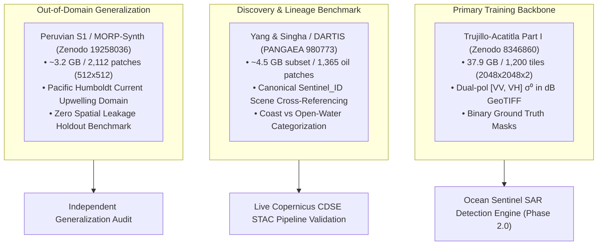
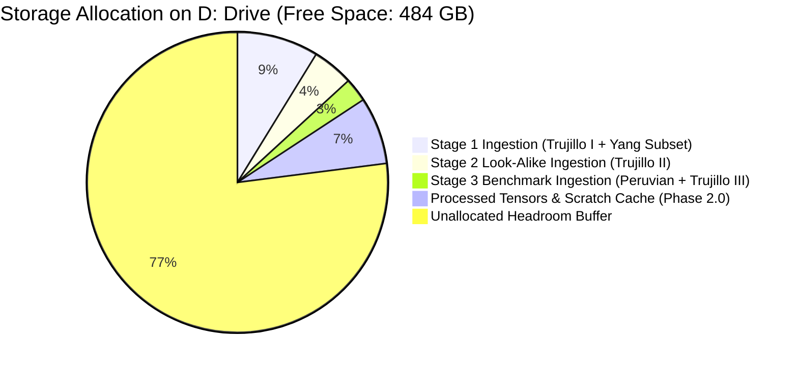
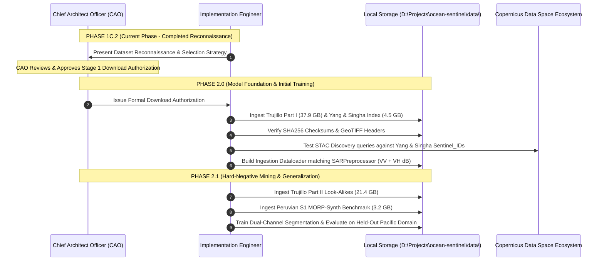

# Phase 1C.2 — Marine Oil-Spill Dataset Selection Strategy

**Document Version**: 1.0.0  
**Status**: APPROVED CANDIDATE STRATEGY FOR CAO SIGN-OFF  
**Author**: Implementation Engineer (Ocean Sentinel Team)  
**Supervisor**: Chief Architect Officer (CAO)  
**Target Date**: September 2026  
**Repository**: `d:\Projects\ocean-sentinel`

---

## 1. Executive Strategy Summary

To empower Ocean Sentinel with state-of-the-art oil spill detection and polygon segmentation while preserving scientific integrity, computational efficiency, and storage constraints, we formulate a **Tripartite Multi-Basin Strategy**:



1. **Primary Segmentation Backbone**: **Trujillo-Acatitla et al. (July 2024) Part I** (Zenodo DOI `10.5281/zenodo.8346860`).
2. **Metadata & Lineage Benchmark**: **Yang & Singha / DARTIS (2025)** (PANGAEA DOI `10.1594/PANGAEA.980773`).
3. **Independent Validation Benchmark**: **Peruvian S1 / MORP-Synth (Dec 2025)** (Zenodo DOI `10.5281/zenodo.19258036`).
4. **Hard-Negative Suppression Expansion (Phase 2.1)**: **Trujillo-Acatitla Part II** (`10.5281/zenodo.8253899` - Look-alikes).

---

## 2. Top 5 Dataset Candidates Ranking

| Rank | Candidate Dataset | Primary Strengths | Strategic Role | Target Size |
| :---: | :--- | :--- | :--- | :---: |
| **1** | **Trujillo-Acatitla et al. (2024)** | Direct $\sigma^0$ dB float32 GeoTIFF rasters; dual-polarization (VV + VH); $2048 \times 2048$ high-resolution segmentation masks; identical format to Phase 1C.1 output. | **Primary Training Backbone** | 37.9 GB (Part I) |
| **2** | **Yang & Singha / DARTIS (2025)** | Full Sentinel-1 scene lineage (`Sentinel_ID`); Eastern Mediterranean coverage; exact timestamps; systematic division into coastal vs open water; polygon vectors. | **Metadata & STAC Discovery Integration** | ~4.5 GB (Subset) |
| **3** | **Peruvian S1 / MORP-Synth (2025)** | Independent Pacific upwelling regime (Humboldt Current); cold-water false-positive benchmark; $512 \times 512$ GeoTIFFs; recent real-world spill data (Callao 2022). | **Out-of-Domain Validation Benchmark** | ~3.2 GB |
| **4** | **SkyTruth Cerulean** | Operational global Sentinel-1 pipeline; vessel-spill track matching logic; reference model for bilge dumping attribution. | **Architecture Blueprint & AIS Reference** | API / Vector layers (< 500 MB) |
| **5** | **NOAA NESDIS SAB MPSR** | US EEZ operational reports; analyst-validated slick boundaries; temporal event ground truth for Gulf of Mexico. | **Case-Study Validation Polygons** | < 500 MB (Vectors) |

---

## 3. Storage Footprint & Headroom Allocation

### 3.1 Host Disk Profile (`D:`)
- **Total Drive Capacity**: ~930 GB
- **Current Free Space**: **~484 GB**
- **Safety Headroom Threshold**: **100 GB** (Reserved for OS, IDE, runtime cache, and temporary Docker volumes)
- **Usable Budget**: **~384 GB**

### 3.2 Allocation Across Implementation Phases



* **Immediate Stage 1 Ingestion**: **42.4 GB** (Trujillo Part I [37.9 GB] + Yang & Singha subset [4.5 GB]). Consumes only **8.8%** of available headroom.
* **Stage 2 Ingestion**: **21.4 GB** (Trujillo Part II look-alike subset). Consumes **4.4%** of headroom.
* **Stage 3 Ingestion**: **12.4 GB** (Peruvian S1 [3.2 GB] + Trujillo Part III test split [9.2 GB]). Consumes **2.6%** of headroom.
* **Total Dataset Footprint Across All Stages**: **76.2 GB** (Leaves >407 GB free).

---

## 4. Staged Ingestion Roadmap



### Stage 1: Immediate Ingestion (Pending CAO Approval)
1. Ingest `Oil_images.zip` (37.92 GB) and `Oil_masks.zip` (5.8 MB) from Zenodo DOI `10.5281/zenodo.8346860`.
2. Ingest metadata catalog and subset patches from PANGAEA DOI `10.1594/PANGAEA.980773`.
3. Validate raster projection, resolution, radiometric values ($\sigma^0_{\text{dB}} \in [-40, 0]$), and binary mask integrity.
4. Execute automated discovery cross-validation: verify that Ocean Sentinel's `SentinelDiscoveryService` successfully locates the original Copernicus L1 GRD products referenced by Yang & Singha's `Sentinel_ID` inventory.

### Stage 2: Look-Alike & Hard-Negative Enrichment (Phase 2.1)
1. Ingest `Lookalike_images.zip` (21.41 GB) and `Lookalike_masks.zip` (6.3 MB) from Zenodo DOI `10.5281/zenodo.8253899`.
2. Construct negative-mining training sampler to suppress low-wind and biogenic slick false alarms.

### Stage 3: Out-of-Domain Pacific Validation (Phase 2.2)
1. Ingest Peruvian S1 benchmark (3.2 GB) from Zenodo DOI `10.5281/zenodo.19258036`.
2. Run automated validation suite to measure out-of-domain generalization without fine-tuning.

---

## 5. Directory Layout & Data Organization

Once downloads are authorized, data will be structured in `d:\Projects\ocean-sentinel\data` adhering to strict separation between raw downloads, preprocessed tensors, and benchmark splits:

```
d:\Projects\ocean-sentinel\
├── data/
│   ├── raw/
│   │   ├── trujillo_2024/
│   │   │   ├── oil_images/          # 2048x2048 float32 dual-pol GeoTIFFs
│   │   │   ├── oil_masks/           # Binary PNG/TIFF masks
│   │   │   └── lookalike_images/    # Stage 2 negative mining
│   │   ├── yang_singha_2025/
│   │   │   ├── metadata_index.csv   # Scene IDs, timestamps, coordinates
│   │   │   └── patches/             # oc, ow, nc, nw subsets
│   │   └── peruvian_s1_2025/
│   │       └── patches/             # 512x512 out-of-domain benchmark
│   ├── processed/
│   │   ├── train/                   # Scene-partitioned training tensors
│   │   ├── val/                     # Scene-partitioned validation tensors
│   │   └── test/                    # Held-out benchmark tensors
│   └── cache/                       # Temporary download & extraction staging
```

> [!NOTE]
> The `data/` directory is already listed in `.gitignore` to prevent multi-gigabyte binary assets from entering git version control.

---

## 6. What NOT to Download Yet

To preserve disk headroom and respect architectural boundaries:

1. ❌ **DO NOT download the full 90 GB Trujillo-Acatitla archive in one monolithic burst**:
   - `NoOil_images.zip` (21.36 GB) contains uniform open ocean tiles that can be synthesized or selectively sampled. Downloading it immediately wastes bandwidth.
2. ❌ **DO NOT download the full 14 GB PANGAEA raster archive**:
   - Only the metadata index and canonical `Sentinel_ID` table (~50 MB) and representative patch subsets are needed initially.
3. ❌ **DO NOT download Krestenitis (2019) or Kaggle dumps**:
   - Flawed radiometry (8-bit quantization) and spatial data leakage make these unfit for production.
4. ❌ **DO NOT download full Copernicus Sentinel-1 raw scenes (1 GB per zip)** without targeted ROI bounding boxes.

---

## 7. Next Actions (Phase 2.0 Kickoff)

Upon CAO authorization of this selection strategy:
1. **Create Download & Verification Script**: Implement `scripts/download_datasets.py` with resume support, chunked streaming, and SHA256 verification.
2. **Implement Dataset Ingestion Layer**: Build `src/ocean_sentinel/detection/dataset.py` with PyTorch-compatible / numpy Dataset abstraction consuming the dual-channel float32 tensors produced by `SARPreprocessor`.
3. **Build Scene-Level Partitioning Splitter**: Implement deterministic dataset splitting based on Sentinel-1 acquisition IDs to strictly prevent spatial data leakage.
