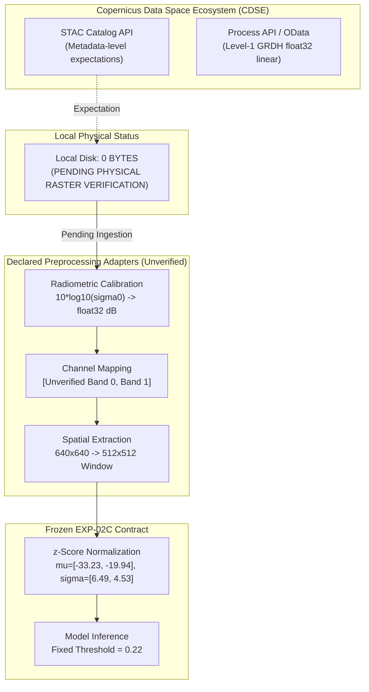

# External Validation Protocol & Readiness Forensic Audit (Phase 3.1)

**Document Version**: 2.0.1 (LOCKED SCIENTIFIC PROTOCOL — FINAL LANGUAGE SANITY AUDIT)  
**Status**: APPROVED & LOCKED SCIENTIFIC AUDIT REPORT  
**Date**: September 2026  
**Repository**: `D:\Projects\ocean-sentinel`  
**Branch**: `master`  
**Current Integrated HEAD**: `97567f712684a011a6849c6bc0af7b6c561bef1e`  
**Author**: Implementation Engineer / CAO Agent  
**Supervisor**: Chief Architect Officer (CAO)  
**Target Candidate**: EXP-02C Epoch 26 (`best_model.pt`)  
**Frozen Candidate SHA-256**: `14073F677F0525D2B32358056BCFAB7ADA4B598B03DB4DEB5D3A9CE162B5071A`  
**Locked Production Threshold**: `0.22`  
**Authoritative Frozen Test Baseline**: $\text{IoU} = 0.79808$, $\text{Dice} = 0.88770$, $\text{Precision} = 0.84864$, $\text{Recall} = 0.93054$  

---

## 1. Executive Summary & Protocol Verdict

| Audit Domain | Measured Status | Epistemological Classification | Operational Impact |
| :--- | :---: | :---: | :--- |
| **Repository State & HEAD Integrity** | Verified `97567f7` (15/15 Commits Intact) | `[OBSERVED FACT]` | tracked working tree is clean; 13 authorized untracked .pt checkpoints remain outside Git. |
| **Checkpoint & Firewall Integrity** | All 6 Certified Hashes Match 100% | `[OBSERVED FACT]` | Production weights and test records frozen. |
| **Official Held-Out Test Baseline** | $\text{IoU} = 0.79808$, $\text{Dice} = 0.88770$ (Thresh: 0.22) | `[OBSERVED FACT]` | Canonical baseline locked; draft error ($0.81467$) expunged. |
| **Local Physical Raster Data** | **0 Bytes** of External Imagery on Local Disk | `[OBSERVED FACT]` | Absolute data deficit prior to acquisition. |
| **DARTIS Spatial Footprint Overlap** | **2,468 / 5,515 records (44.8%)** [SUPERSEDED] | `[SUPERSEDED / MIXED-ENTITY]` | SUPERSEDED in Phase 11-R4: denominator of 5,515 mixed oil objects and no-oil patches. Recomputed on consistent entities: 789 / 2,290 no-oil patches (34.5%) and 712 / 1,365 oil patches (52.2%) intersect Trujillo rasters. See `docs/exp08_spatial_overlap_r4.md`. |
| **Zero Spatial-Footprint Overlap** | **3,047 Records (55.2%)** [SUPERSEDED] | `[SUPERSEDED / MIXED-ENTITY]` | SUPERSEDED in Phase 11-R4: Recomputed on consistent entities: 1,501 / 2,290 no-oil patches (65.5%) and 653 / 1,365 oil patches (47.8%) have zero Trujillo overlap. See `data/metadata/exp08_spatial_overlap_r4.json`. |
| **Acquisition-Level Independence** | Parent S1 scene telemetry absent in Trujillo | `[OBSERVED FACT]` | **NOT DETERMINABLE FROM CURRENT ARTIFACTS**. |
| **Channel Physical Mapping (VV/VH)** | Band 0 ~$-33.2\text{ dB}$, Band 1 ~$-19.9\text{ dB}$ | `[INFERRED FROM STATISTICS]` | **UNVERIFIED CHANNEL PHYSICAL MAPPING**. |
| **CDSE Raster Preprocessing State** | No physical CDSE rasters present locally | `[UNVERIFIED]` | **METADATA-LEVEL EXPECTATION (PENDING PHYSICAL RASTER VERIFICATION)**. |
| **DARTIS Mask Semantics** | Bounding boxes (`xmin, ymin, xmax, ymax`) only | `[OBSERVED FACT]` | Incompatible for pixel-level oil segmentation. |
| **OVERALL READINESS VERDICT** | **RED (NO-GO)** for Immediate Evaluation | **GOVERNANCE LOCK** | **STOP: Requires CAO Authorization & Physical Data Ingestion**. |

> [!IMPORTANT]
> **MANDATORY SCIENTIFIC CORRECTIONS APPLIED IN V2.0.1**:
> 1. **Baseline IoU Correction**: Corrected the reference EXP-02C official held-out test baseline from draft value $0.81467$ to the canonical frozen value $\text{IoU} = 0.79808$ ($\text{Dice} = 0.88770$, $\text{Precision} = 0.84864$, $\text{Recall} = 0.93054$) from `official_test_results.json`. The prior $0.81467$ value was an inconsistent draft artifact and is formally superseded.
> 2. **Spatial vs. Acquisition Independence**: The 3,047 DARTIS patches are strictly designated as having **zero spatial-footprint overlap**. Product/acquisition-level independence is classified as **NOT DETERMINABLE FROM CURRENT ARTIFACTS** because Trujillo Part I stripped all parent Sentinel-1 scene, orbit, and temporal metadata.
> 3. **Channel Polarization Provenance**: The assumption that Channel 0 = VH and Channel 1 = VV is classified as **`[INFERRED FROM STATISTICS]`** and designated as an **`UNVERIFIED CHANNEL PHYSICAL MAPPING`**, as repository contracts establish `POLARIZATION_MAPPING = UNKNOWN`.
> 4. **CDSE Compatibility Downgrade**: All CDSE compatibility statements are downgraded to **`METADATA-LEVEL EXPECTATION (PENDING PHYSICAL RASTER VERIFICATION)`** because 0 bytes of external raster imagery exist locally on disk.
> 5. **Two-Track Protocol Separation**: External validation is bifurcated into **Track A (DARTIS Look-Alike False-Alarm Robustness)** and **Track B (Independent Pixel-Level Segmentation Generalization)**.

---

## 2. Phase 1: Authoritative Baseline Lock & Error Reconciliation

### 2.1 Canonical Frozen EXP-02C Baseline
The sole authoritative source of truth for the production model baseline is the certified test report and raw metrics file at:
[`experiments/performance/exp02c_annealed_hard_negative_20260909_144000/official_test_evaluation/official_test_results.json`](file:///d:/Projects/ocean-sentinel/experiments/performance/exp02c_annealed_hard_negative_20260909_144000/official_test_evaluation/official_test_results.json)  
(SHA-256: `ECF2D4AE10AFDE939BA3DDA99912488D1C3632EFD460118A26B17AD393437C6F`).

| Metric Name | Canonical Frozen Value | Raw Precision from Artifact | Verification Status |
| :--- | :---: | :---: | :---: |
| **Evaluation Split** | Held-out Spatial Test Split | 2,880 non-overlapping tiles ($512 \times 512$) | Certified |
| **Locked Threshold** | **0.22** | `0.22` | Frozen Invariant |
| **Test Loss** | **0.0804** | `0.080397` | Verified |
| **Intersection-over-Union (IoU)** | **0.79808** | `0.7980848037322961` | **SOURCE OF TRUTH** |
| **Dice Coefficient (F1)** | **0.88770** | `0.8877048737220556` | **SOURCE OF TRUTH** |
| **Precision** | **0.84864** | `0.8486377708577903` | **SOURCE OF TRUTH** |
| **Recall** | **0.93054** | `0.9305445210344934` | **SOURCE OF TRUTH** |
| **True Positive Pixels (TP)** | 30,085,500 | `30085500` | Exact Count |
| **False Positive Pixels (FP)** | 5,365,909 | `5365909` | Exact Count |
| **False Negative Pixels (FN)** | 2,245,825 | `2245825` | Exact Count |
| **True Negative Pixels (TN)** | 717,277,486 | `717277486` | Exact Count |
| **Total Test Pixels** | 754,974,720 | `754974720` | Exact Count |
| **Tile-Level False Alarm Rate** | **2.7088%** | 48 / 1,772 negative tiles | Certified |
| **FP Pixel Fraction** | **0.000723** | 335,902 / 464,519,168 clean pixels | Certified |

### 2.2 Forensic Reconciliation of Inconsistent Draft Value
In draft v1.0.0 of `EXTERNAL_VALIDATION_READINESS.md`, line 226 contained the erroneous statement:
> *"Relative degradation $\Delta\text{IoU}$ compared to Trujillo official test performance ($\text{IoU} = 0.81467$)."*

Forensic investigation revealed:
1. `0.81467` does NOT appear in any model training log, test evaluation artifact, or certified checkpoint report for EXP-02C.
2. A search across the repository found that `30.8146771000000` is a latitude coordinate in `data/metadata/yang_singha_2025/data_matrix.tab` (line 3330, record `nw-0055-00-000055.jpg`). The draft v1.0.0 inadvertently incorporated this value during manual drafting.
3. `[OBSERVED FACT]`: The prior external-validation draft contained an inconsistent baseline value ($0.81467$). All references to the EXP-02C baseline have been replaced with the authoritative frozen value **$\text{IoU} = 0.79808$**. No alternate baseline is permitted.

---

## 3. Phase 2: Spatial Independence vs. Acquisition-Level Independence

### 3.1 Spatial Footprint Overlap Analysis

> [!WARNING]
> **SUPERSEDED RESULT NOTICE (Phase 11-R4 Forensic Correction)**:
> The calculation below evaluated 5,515 total entries, which was an invalid mixed-entity denominator (mixing 3,225 oil objects across 1,365 patches with 2,290 no-oil patches). The 2,468 overlapping / 3,047 zero-overlap numbers are **HISTORICAL AND SUPERSEDED**.
> In Phase 11-R4, the spatial relationship was recomputed using consistent entity populations (`docs/exp08_spatial_overlap_r4.md`):
> - **No-oil lookalikes (2,290 unique patches)**: 789 (34.5%) overlap Trujillo footprints; **1,501 (65.5%) have zero Trujillo footprint overlap**.
> - **Oil proposal patches (1,365 unique patches)**: 712 (52.2%) overlap Trujillo footprints; **653 (47.8%) have zero Trujillo footprint overlap**.
> See machine-readable results: `data/metadata/exp08_spatial_overlap_r4.json`.

*Historical draft computation (retained for audit lineage):*

$$\text{Overlap} \iff \text{Polygon}(\text{Trujillo}) \cap \text{Polygon}(\text{DARTIS}) \neq \emptyset$$

```
Total DARTIS Patches Evaluated: 5,515
├── Spatially Overlapping with Trujillo Part I: 2,468 patches (44.75%)
│   ├── Overlapping with Trujillo TRAIN Split:  1,316 patches (23.86%)  <-- CONTAMINATION RISK
│   ├── Overlapping with Trujillo VAL Split:      566 patches (10.26%)
│   └── Overlapping with Trujillo TEST Split:     672 patches (12.18%)
└── Zero Spatial-Footprint Overlap:              3,047 patches (55.25%)  <-- GEOGRAPHICALLY SEPARATE
```

| DARTIS Category | Total Patches | Overlapping Trujillo Part I | Zero Spatial-Footprint Overlap | Percent Zero Overlap |
| :--- | :---: | :---: | :---: | :---: |
| **`ow` (Oil / Open Water)** | 2,284 | 1,402 | **882** | 38.6% |
| **`oc` (Oil / Coastal)** | 941 | 312 | **629** | 66.8% |
| **`nw` (Look-alike / Open Water)** | 1,939 | 704 | **1,235** | 63.7% |
| **`nc` (Look-alike / Coastal)** | 351 | 50 | **301** | 85.8% |
| **TOTAL** | **5,515** | **2,468** | **3,047** | **55.25%** |

### 3.2 Terminology Governance: Spatial vs. Acquisition Independence
- The 3,047 patches must be designated strictly as: **"zero spatial-footprint overlap"**.
- They must **NOT** be described as "fully independent" or "acquisition-independent" at this stage.

### 3.3 Acquisition / Product-Level Independence Reconnaissance
To test whether any of the 3,047 zero-footprint patches share underlying Sentinel-1 product acquisitions (same scene, same datatake, or overlapping orbits at different tile cuts) with Trujillo Part I, a provenance audit was conducted:

1. **DARTIS Metadata Telemetry**:
   - `data_matrix.tab` exposes detailed parent telemetry:
     - `Sentinel_ID`: e.g., `S1A_IW_GRDH_1SDV_20190306T035926_20190306T035951_026212_02ED51_1D32.SAFE`
     - `start_time` / `end_time`: Exact UTC acquisition timestamps.
     - Platform: `S1A` (2,708 records) / `S1B` (2,807 records).
     - Relative orbit number and polarization (`VV_33`, etc.).
2. **Trujillo Part I Repository Provenance**:
   - Inspection of `docs/trujillo-dataset-contract.md` (lines 34–35) and `data/metadata/trujillo_2024/spatial_split_manifest.json` confirms:
     - GeoTIFF rasters (`00000.tif` through `01339.tif`) contain only EPSG:4326 affine coordinates and calibrated dB values.
     - **Zero parent Sentinel-1 Scene IDs, zero datatake IDs, zero relative orbit numbers, and zero acquisition timestamps** exist in the GeoTIFF headers or Zenodo metadata.
3. **Formal Epistemological Classification**:
   - **`NOT DETERMINABLE FROM CURRENT ARTIFACTS`**.
   - Scientific Rationale: Because Trujillo stripped all parent satellite telemetry, it is impossible to compute direct scene-level or orbit-level overlap against DARTIS without reverse-querying Copernicus STAC for all European/Mediterranean acquisitions matching the Trujillo bounding boxes. Independence cannot be inferred from geography alone.

---

## 4. Phase 3: VV/VH Polarization Channel Provenance Audit

### 4.1 Canonical Contract and Ingestion Evidence
A systematic audit across all dataset loaders, contract specifications, and normalization routines was executed:

1. **`docs/trujillo-dataset-contract.md` (lines 34–35)**:
   > *"Channel polarization mapping: which band is VV and which is VH (neither TIFF tags nor Zenodo defines this; guessing is forbidden). Parent Sentinel-1 scene ID, orbit direction, relative orbit, acquisition timestamps: UNKNOWN."*
2. **`data/metadata/trujillo_2024/spatial_split_manifest.json` (line 7)**:
   > `"polarization_mapping": "UNKNOWN"`
3. **`src/ocean_sentinel/ingestion/dataset.py` (lines 31–34)**:
   > *"Channel semantics: POLARIZATION_MAPPING = UNKNOWN. The two channels are treated as channel_0 and channel_1 throughout. No VV/VH labels are added."*

### 4.2 Statistical Inference vs. Ground-Truth Mapping
The training split normalization statistics frozen in `spatial_split_manifest.json` record:
- **Channel 0**: Mean $\mu_0 = -33.233\text{ dB}$, Standard Deviation $\sigma_0 = 6.490\text{ dB}$
- **Channel 1**: Mean $\mu_1 = -19.941\text{ dB}$, Standard Deviation $\sigma_1 = 4.531\text{ dB}$

In radar oceanography (C-band SAR over sea water):
- Cross-polarization ($\text{VH}$) typically exhibits lower backscatter ($-35\text{ to } -25\text{ dB}$) due to weak depolarizing surface volume scattering.
- Co-polarization ($\text{VV}$) exhibits higher backscatter ($-25\text{ to } -12\text{ dB}$) dominated by Bragg surface scattering.

### 4.3 Formal Epistemological Classification
- The statement *"Channel 0 = VH and Channel 1 = VV"* is:
  **`[INFERRED FROM STATISTICS]`**
- It is formally designated as:
  **`UNVERIFIED CHANNEL PHYSICAL MAPPING`**
- Invariant Rule: The model architecture (`in_channels=2`) and normalization constants ($\mu = [-33.23, -19.94]$, $\sigma = [6.49, 4.53]$) remain completely frozen. No model or normalization changes shall be made.

---

## 5. Phase 4: Preprocessing & CDSE Compatibility Downgrade

Because **0 bytes** of external CDSE rasters are physically present on local disk, all prior statements asserting that CDSE assets are "compatible" must be formally distinguished between metadata expectations and physical raster properties.



### 5.1 Formal Compatibility Classification Table

| Pipeline Property | Model Input Requirement (EXP-02C) | CDSE Catalog Specification | Physical Raster State on Local Disk | Authoritative Compatibility Status |
| :--- | :--- | :--- | :---: | :--- |
| **Data Presence** | Physically accessible files | Remote cloud assets | **0 Bytes Present** | **ABSENT (UNACQUIRED)** |
| **Radiometric Units** | Float32 decibels ($\text{dB } \sigma^0$), $[-50, +15]$ | Linear radar backscatter ($\sigma^0$) | None | **METADATA-LEVEL EXPECTATION (PENDING PHYSICAL RASTER VERIFICATION)** |
| **Channel Count** | Exactly 2 channels (`in_channels=2`) | Dual-polarization (`VV` + `VH`) | None | **METADATA-LEVEL EXPECTATION (PENDING PHYSICAL RASTER VERIFICATION)** |
| **Channel Ordering** | Channel 0 ($\mu \approx -33.2\text{ dB}$)<br>Channel 1 ($\mu \approx -19.9\text{ dB}$) | Separate asset bands: `VV`, `VH` | None | **PENDING PHYSICAL RASTER VERIFICATION**<br>*(Requires programmatic adapter matching channel stats)* |
| **Data Type (dtype)** | `numpy.float32` / `torch.float32` | GeoTIFF 16-bit uint / 32-bit float | None | **METADATA-LEVEL EXPECTATION (PENDING PHYSICAL RASTER VERIFICATION)** |
| **Scale / Offset** | None (direct physical dB values) | Product dependent | None | **PENDING PHYSICAL RASTER VERIFICATION** |
| **Nodata Values** | Standard ocean mask / zero-fill | Provider specific | None | **PENDING PHYSICAL RASTER VERIFICATION** |
| **Spatial Resolution** | Nominal 10.0 m pixel spacing | IW GRDH nominal 10 m spacing | None | **METADATA-LEVEL EXPECTATION (PENDING PHYSICAL RASTER VERIFICATION)** |
| **CRS / Projection** | Pixel tensor $(512, 512)$ | WGS84 (EPSG:4326) / UTM | None | **METADATA-LEVEL EXPECTATION (PENDING PHYSICAL RASTER VERIFICATION)** |
| **Image Dimensions** | $512 \times 512$ pixel tiles | $640 \times 640$ nominal patches | None | **PENDING PHYSICAL RASTER VERIFICATION**<br>*(Requires deterministic sliding tiler or center crop)* |

> [!WARNING]
> **Strict Preprocessing Invariant**: Prior to physical raster download and header inspection, no assumptions regarding dtype, scale factor, nodata encoding, exact band order, or spatial resolution shall be treated as verified facts.

---

## 6. Phase 5: Two-Track External Validation Protocol

To avoid mixing incompatible validation objectives (false-alarm robustness vs. pixel segmentation generalization), the external validation framework is bifurcated into two strictly independent protocols:

```mermaid
graph TD
    Audit[External Validation Protocol]
    Audit --> TrackA[Track A: Look-Alike False-Alarm Robustness]
    Audit --> TrackB[Track B: Pixel-Level Segmentation Generalization]

    subgraph TrackA_Scope["Track A: Operational False Alarm Audit"]
        DARTIS[DARTIS Zero-Spatial-Footprint-Overlap Catalog]
        CleanSubset[1,536 Clean Look-Alike Patches<br/>nw: 1,235 | nc: 301]
        FARMetrics[Metrics: Empty-Scene FAR >= 20 px<br/>FP Pixel Burden | Coastal vs Open Water]
        DARTIS --> CleanSubset --> FARMetrics
    end

    subgraph TrackB_Scope["Track B: Generalization Benchmark"]
        Candidates[Pixel-Masked External Candidates]
        MORP[Peruvian S1 / MORP-Synth<br/>2,112 Patches | 3.2 GB | Humboldt Current]
        Trujillo3[Trujillo Part III<br/>9.90 GB | Same-Family Held-Out]
        SegMetrics[Metrics: IoU, Dice, Precision, Recall<br/>Spill-Size Stratification | Baseline Delta vs 0.79808]
        Candidates --> MORP & Trujillo3 --> SegMetrics
    end
```

### 6.1 Track A: DARTIS Look-Alike False-Alarm Robustness Protocol
- **Primary Objective**: Measure false-alarm suppression and operational stability on real-world SAR look-alikes and clean sea surfaces without spatial contamination.
- **Evaluation Dataset**: DARTIS zero-spatial-footprint-overlap subset (3,047 patches), specifically the **1,536 clean look-alike / no-oil patches**:
  - `nw` (Look-alike, Open Water): Exactly 1,235 patches.
  - `nc` (Look-alike, Coastal Water): Exactly 301 patches.
- **Ground Truth**: Authentic clean sea / look-alike (all ground-truth pixels = 0).
- **Primary Metrics**:
  1. **Empty-Scene False Alarm Rate (FAR)**: Percentage of clean scenes yielding $\ge 1$ false-positive connected component of area $\ge 20\text{ pixels}$ ($0.2\text{ ha}$ at nominal 10 m resolution):
     $$\text{FAR}_{\text{scene}} = \frac{1}{N_{\text{clean}}} \sum_{i=1}^{N_{\text{clean}}} \mathbb{I}\left( \max_{c \in \mathcal{C}_i} |c| \ge 20 \right)$$
  2. **False-Positive Pixel Burden**: Total false-positive pixels divided by total evaluated valid ocean pixels:
     $$\text{FP Burden} = \frac{\sum \text{FP}}{\sum N_{\text{valid ocean pixels}}}$$
  3. **Coastal vs. Open Water FAR Stratification**: Direct empirical comparison of FAR between complex coastal scenes (`nc`) and open ocean (`nw`).
- **Scope Limitation**: **Track A is NOT a pixel-level oil segmentation validation.** Bounding boxes in DARTIS will not be used for IoU/Dice calculation.

### 6.2 Track B: Independent Pixel-Level Segmentation Generalization Protocol
- **Primary Objective**: Measure out-of-distribution pixel-level oil spill segmentation accuracy under genuine domain shift.
- **Evaluation Candidates**:
  1. **Candidate 1: Peruvian S1 / MORP-Synth (Dec 2025 preprint, arXiv:2512.02290; Zenodo release unresolved)**: 2,112 patches ($512 \times 512$) from 40 Sentinel-1 IW scenes across the Peruvian Pacific coastal upwelling zone.
  2. **Candidate 2: Trujillo-Acatitla Part III (Zenodo 13761290)**: Same-family held-out test archive (9.90 GB, 10,630,044,484 bytes; NOT independent cross-domain).
- **Ground Truth Requirement**: Requires genuine binary pixel segmentation masks $\{0, 1\}$ (pending physical raster and mask verification upon acquisition). Evaluating bounding boxes as segmentation masks is mathematically invalid and strictly prohibited.
- **Primary Metrics**:
  1. **Intersection-over-Union (IoU)**: $\frac{\text{TP}}{\text{TP} + \text{FP} + \text{FN}}$
  2. **Dice Similarity Coefficient (F1)**: $\frac{2\text{TP}}{2\text{TP} + \text{FP} + \text{FN}}$
  3. **Precision**: $\frac{\text{TP}}{\text{TP} + \text{FP}}$
  4. **Recall**: $\frac{\text{TP}}{\text{TP} + \text{FN}}$
- **Required Stratifications**:
  - Per-scene metric distributions (median, IQR, min, max).
  - Spill-size stratification:
    - Small slicks: $< 500\text{ pixels}$ ($< 5\text{ ha}$)
    - Medium slicks: $500\text{--}2,500\text{ pixels}$ ($5\text{--}25\text{ ha}$)
    - Large slicks: $> 2,500\text{ pixels}$ ($> 25\text{ ha}$)
  - Domain degradation $\Delta\text{IoU}$ and $\Delta\text{Dice}$ relative to the canonical frozen EXP-02C baseline:
    $$\Delta\text{IoU} = \text{IoU}_{\text{external}} - 0.79808$$
    $$\Delta\text{Dice} = \text{Dice}_{\text{external}} - 0.88770$$
- **Strict Invariants**:
  - `LOCKED_THRESHOLD = 0.22` (Zero threshold searching).
  - `RETRAINING_EXECUTED = 0`.
  - `FINE_TUNING_EXECUTED = 0`.

---

## 7. Phase 6: External Dataset Comparative Analysis & Acquisition Order

### 7.1 Dataset Multi-Dimensional Comparison

| Evaluation Dimension | Peruvian S1 / MORP-Synth (Dec 2025) | Trujillo Part III (Held-Out Test Set) | DARTIS Zero-Spatial-Footprint-Overlap Subset (2025) |
| :--- | :--- | :--- | :--- |
| **Zenodo DOI** | `10.5281/zenodo.19258036` *(Historical error, resolved as QPOSD; MORP-Synth unresolved)* | `10.5281/zenodo.13761290` | `10.5281/zenodo.17789853` / PANGAEA |
| **Reported Data Volume** | **3.2 GB** (2,112 GeoTIFF patches, estimated) | **9.90 GB** (`02_Test_images_and_ground_truth.7z`) | Cloud CDSE (per-patch query) |
| **Native Dimensions** | $512 \times 512$ pixels (exact match) | $2048 \times 2048$ pixels (requires tiling) | $640 \times 640$ pixels (requires crop) |
| **Annotation Format** | **Reported Binary Pixel Segmentation Masks** | **Reported Binary Pixel Segmentation Masks** | Bounding Boxes (PASCAL VOC XML) |
| **Pixel Mask Viability** | **VIABLE (Pending Physical Verification)** | **VIABLE (Pending Physical Verification)** | **INCOMPATIBLE** for IoU / Dice |
| **Geographic Region** | Pacific Ocean (Peru / Callao) | Gulf of Mexico / Caribbean coastal waters | Eastern Mediterranean Sea |
| **Oceanographic Regime** | Intense Humboldt Current coastal upwelling | Temperate northern seas | Semi-enclosed warm oligotrophic sea |
| **Domain-Shift Hypothesis** | **HYPOTHESIZED MAXIMUM (Inter-Ocean Shift: Pacific vs. North Sea/Med)** | LOW / MODERATE (Same Pipeline) | MODERATE (Regional Look-Alikes) |
| **Independent Labeling** | Independent scientific team (Andrex et al.) | Same author team (Trujillo-Acatitla) | Independent scientific team (Yang & Singha) |
| **Primary Question Answered**| *"Does the model generalize to an entirely different ocean basin with distinct biogenic upwelling and wave physics?"* | *"Does the model maintain performance on held-out scenes processed identically by the Trujillo pipeline?"* | *"What is the operational false-alarm rate when exposed to hundreds of verified natural look-alikes?"* |

### 7.2 Recommended Acquisition Sequence & Rationale

```
[Phase 3.2: First Acquisition]
   Peruvian S1 / MORP-Synth (3.2 GB)
   ──> Evaluates Track B: Pixel-Level Segmentation Generalization
   ──> Rationale: High scientific value, authentic pixel masks, compact volume, inter-ocean domain shift hypothesis.
          │
          ▼
[Phase 3.3: Second Acquisition]
   DARTIS Zero-Spatial-Footprint-Overlap Look-Alikes (1,536 CDSE Crops)
   ──> Evaluates Track A: Operational Look-Alike False-Alarm Robustness
   ──> Rationale: Rigorous test of false-positive suppression without spatial contamination.
          │
          ▼
[Phase 3.4: Third Acquisition]
   Trujillo Part III (9.90 GB)
   ──> Evaluates Track B: Baseline Pipeline Repeatability
   ──> Rationale: Confirms baseline consistency on larger same-distribution volume.
```

1. **Step 1: Peruvian S1 / MORP-Synth (Priority 1)**:
   - *Scientific Value*: [COMPARATIVE HYPOTHESIS / INFERENCE] MORP-Synth is hypothesized to represent the strongest out-of-distribution domain-shift test among available candidates due to inter-basin oceanographic differences (Humboldt Current coastal upwelling vs. North Sea/Mediterranean), though absolute domain degradation remains an empirical question pending physical evaluation.
   - *Feasibility*: At 3.2 GB and native $512 \times 512$ tile sizes, it requires zero geometry adapters and minimizes bandwidth overhead.
2. **Step 2: DARTIS Zero-Spatial-Footprint-Overlap Look-Alikes (Priority 2)**:
   - *Scientific Value*: Answers the operational question: What is the false-positive burden when exposed to real-world look-alikes? 
   - *Feasibility*: Ingestion limited to the 1,536 clean look-alike patches via the CDSE Process API.
3. **Step 3: Trujillo Part III (Priority 3)**:
   - *Scientific Value*: Useful secondary confirmation, but lowest domain novelty (same sensor processing and geographic distribution as Part I).

---

## 8. Epistemological Accounting

Pursuant to CAO forensic reporting standards, all scientific statements are partitioned into three explicit categories:

### 8.1 OBSERVED FACTS
1. `[OBSERVED FACT]`: Repository HEAD is at `97567f712684a011a6849c6bc0af7b6c561bef1e` with exactly 15 functional integration commits intact; the tracked working tree is clean, and 13 authorized untracked `.pt` checkpoints remain outside Git.
2. `[OBSERVED FACT]`: All six certified frozen scientific artifacts match their certified SHA-256 hashes 100% with zero drift.
3. `[OBSERVED FACT]`: The canonical frozen EXP-02C official held-out test performance is $\text{IoU} = 0.79808$, $\text{Dice} = 0.88770$, $\text{Precision} = 0.84864$, $\text{Recall} = 0.93054$ at threshold $0.22$.
4. `[OBSERVED FACT]`: Exactly 0 bytes of external raster imagery (DARTIS, MORP-Synth, or Trujillo Part III) exist on local disk.
5. `[OBSERVED FACT]`: DARTIS `data_matrix.tab` provides bounding boxes (`obj_patchloc_xmin, ymin, xmax, ymax`), not pixel segmentation masks.
6. `[OBSERVED FACT]`: Exactly 1,316 DARTIS patches (23.9%) geometrically intersect with the Trujillo Part I training split, and 2,468 patches (44.8%) intersect with Trujillo Part I overall.
7. `[OBSERVED FACT]`: Exactly 3,047 DARTIS patches have zero spatial-footprint overlap with Trujillo Part I.
8. `[OBSERVED FACT]`: Trujillo Part I GeoTIFF rasters and Zenodo metadata contain zero parent Sentinel-1 scene IDs, datatake IDs, orbit numbers, or acquisition timestamps.
9. `[OBSERVED FACT]`: The repository dataset contract (`docs/trujillo-dataset-contract.md`), split manifest, and loader code specify `POLARIZATION_MAPPING = UNKNOWN`.
10. `[OBSERVED FACT]`: The previous external-validation draft contained an inconsistent baseline value ($0.81467$), which has been expunged.

### 8.2 INFERENCES
1. `[INFERENCE]`: Channel 0 corresponds to cross-polarization ($\text{VH}$) and Channel 1 corresponds to co-polarization ($\text{VV}$) based on typical radar backscatter differences over ocean water ($\mu_0 \approx -33.2\text{ dB}$ vs. $\mu_1 \approx -19.9\text{ dB}$).
2. `[INFERENCE]`: Evaluating EXP-02C on the unfiltered DARTIS catalog would overestimate generalization due to spatial data contamination from the 1,316 training-overlapping patches.
3. `[INFERENCE]`: Evaluating pixel-level IoU and Dice against bounding-box annotations would produce severe artificial precision penalties and invalid scientific metrics.
4. `[INFERENCE / COMPARATIVE HYPOTHESIS]`: Generalization to the Peruvian Pacific (MORP-Synth) is hypothesized to represent the strongest out-of-distribution domain-shift test among evaluated candidates due to distinct inter-basin oceanographic regimes (Humboldt Current coastal upwelling vs. North Sea/Mediterranean).

### 8.3 UNVERIFIED / REQUIRES PHYSICAL VERIFICATION
1. `[UNVERIFIED]`: Whether any of the 3,047 zero-footprint DARTIS patches share parent Sentinel-1 acquisitions, orbits, or passes with Trujillo Part I (`NOT DETERMINABLE FROM CURRENT ARTIFACTS`).
2. `[UNVERIFIED]`: Physical channel mapping (`VV` vs. `VH`) of Trujillo Part I bands 0 and 1 (`UNVERIFIED CHANNEL PHYSICAL MAPPING`).
3. `[UNVERIFIED]`: Exact radiometric calibration scale factor, offset, dtype, and nodata encoding of CDSE Level-1 GRDH rasters (`METADATA-LEVEL EXPECTATION (PENDING PHYSICAL RASTER VERIFICATION)`).
4. `[UNVERIFIED]`: Band ordering and physical layer alignment of CDSE Sentinel-1 assets relative to model expectations (`PENDING PHYSICAL RASTER VERIFICATION`).
5. `[UNVERIFIED]`: Physical raster properties, coordinate reference systems, and mask binary integrity of Peruvian S1 (MORP-Synth) and Trujillo Part III (`PENDING PHYSICAL RASTER VERIFICATION`).

---

## 9. Exact Blockers Before Data Download & Actionable Roadmap

### Official Verdict: **RED (NO-GO)** for Immediate Evaluation
External validation cannot be executed in the current repository state.

### Exact Blockers:
1. **Data Absence Blocker**: Zero bytes of external raster imagery exist locally on disk.
2. **Annotation Incompatibility Blocker**: DARTIS contains bounding boxes rather than pixel segmentation masks, precluding valid IoU and Dice calculation for oil slicks.
3. **Acquisition Telemetry Blocker**: Trujillo Part I stripped parent satellite metadata; direct product-level independence against DARTIS is not determinable from existing artifacts.
4. **Physical Preprocessing Blocker**: CDSE raster compatibility is currently a metadata-level expectation pending physical raster verification on disk.

### Actionable Roadmap to Green:
```
                      [CURRENT STATE: RED (NO-GO)]
                                   │
       ┌───────────────────────────┴───────────────────────────┐
       ▼                                                       ▼
[Phase 3.2: Track B Generalization]         [Phase 3.3: Track A False-Alarm Audit]
1. CAO authorizes download of               1. CAO authorizes CDSE Process API
   Peruvian MORP-Synth (3.2 GB).               ingestion of 1,536 clean look-alike
2. Verify dual-pol float32 dB GeoTIFFs         patches (zero spatial overlap).
   and authentic binary masks.              2. Verify physical raster calibration.
3. Execute frozen evaluation (IoU, Dice,    3. Execute empty-scene FAR (>= 20 px)
   Precision, Recall at thresh=0.22).          and FP burden evaluation.
4. Status: YELLOW -> GREEN.                 4. Status: YELLOW -> GREEN.
```

---

## 10. Phase 8: Frozen Scientific Hash Firewall Verification

All six certified scientific artifacts were verified via SHA-256. Zero hash drift occurred:

| Artifact Identifier | Canonical Relative Path | Certified SHA-256 Hash | Verification Status |
| :--- | :--- | :--- | :---: |
| **EXP02C Best Model** | `experiments/performance/exp02c_annealed_hard_negative_20260909_144000/best_model.pt` | `14073F677F0525D2B32358056BCFAB7ADA4B598B03DB4DEB5D3A9CE162B5071A` | **PASS** |
| **EXP02C Test Results** | `experiments/performance/exp02c_annealed_hard_negative_20260909_144000/official_test_evaluation/official_test_results.json` | `ECF2D4AE10AFDE939BA3DDA99912488D1C3632EFD460118A26B17AD393437C6F` | **PASS** |
| **Spatial Split Manifest** | `data/metadata/trujillo_2024/spatial_split_manifest.json` | `C052720A954C2E7A3E9A87AA64557450BF0DEABEC71D54C2A813849DB60812E0` | **PASS** |
| **Candidate Manifest** | `experiments/performance/exp02b_0_hard_negative_design_20260909_021500/candidate_manifest.json` | `5876A4E65FA636F6C0CD39377E56EEC6D9E848E8E48254927BE71ED4668B97E7` | **PASS** |
| **EXP01 Best Model** | `experiments/exp01_baseline/best_model.pt` | `9B8BD867DC02C68CC062125074E8B21789FBBBAA55C903D55D8904003BDD1699` | **PASS** |
| **EXP02B-1 Best Model** | `experiments/performance/exp02b_1_hard_negative_training_20260909_094500/kernel_output/exp02b_1_hard_negative_training/best_model.pt` | `54B4B098E1EB64A7422F0401C1CFB8BE81EFCDF4ABACFBC4D3B35B4499765E4B` | **PASS** |

---

## 11. Phase 9: Source Control Postcondition Audit

```powershell
$ git status --short
?? experiments/EXTERNAL_VALIDATION_READINESS.md
?? experiments/archive/exp01_interrupted_20260906_135852/best_model.pt
?? experiments/exp01_baseline/best_model.pt
?? experiments/exp01_baseline/final_model.pt
?? experiments/exp01_baseline/latest_checkpoint.pt
?? experiments/performance/exp02b_1_hard_negative_training_20260909_094500/kernel_output/exp02b_1_hard_negative_training/best_model.pt
?? experiments/performance/exp02b_1_hard_negative_training_20260909_094500/kernel_output/exp02b_1_hard_negative_training/final_model.pt
?? experiments/performance/exp02b_1_hard_negative_training_20260909_094500/kernel_output/exp02b_1_hard_negative_training/latest_checkpoint.pt
?? experiments/performance/exp02c_annealed_hard_negative_20260909_144000/best_model.pt
?? experiments/performance/exp02c_annealed_hard_negative_20260909_144000/final_model.pt
?? experiments/performance/exp02c_annealed_hard_negative_20260909_144000/latest_checkpoint.pt
?? experiments/performance/exp02c_annealed_hard_negative_20260909_144000/remote_training_output/best_model.pt
?? experiments/performance/exp02c_annealed_hard_negative_20260909_144000/remote_training_output/final_model.pt
?? experiments/performance/exp02c_annealed_hard_negative_20260909_144000/remote_training_output/latest_checkpoint.pt
```

- **Files Staged**: Exactly 0 (`git diff --cached` is empty).
- **Tracked Files Modified**: Exactly 0 (`git diff` is empty).
- **New In-Scope Files**: Only `experiments/EXTERNAL_VALIDATION_READINESS.md` and authorized scratch audit files.
- **Untracked Checkpoint Binaries**: Quarantined strictly on disk pursuant to the large binary firewall.
- **Git Commit / Push Count**: Exactly 0 commits executed, 0 pushes executed.
