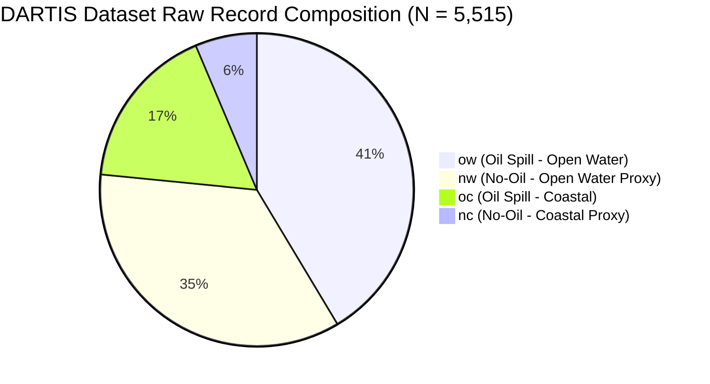
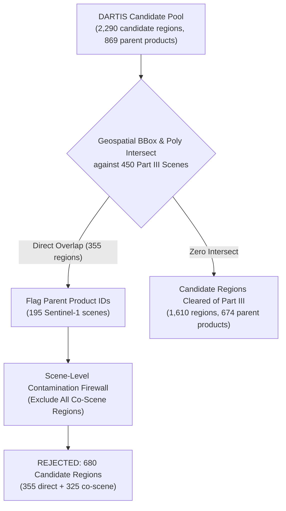

# Ocean Sentinel — Phase 7A Final Data Governance & Development Protocol Foundation Report
**Document ID**: `PHASE_7A_DATA_PROTOCOL_FOUNDATION_REPORT_20260912`  
**Classification**: CAO AUDIT REPORT / CANONICAL SCIENTIFIC SPECIFICATION  
**Author**: Senior CAO Scientific Process Auditor & Data Governance Gatekeeper  
**Date**: September 12, 2026  
**Repository**: `D:\Projects\ocean-sentinel`  
**Git Branch**: `master` | **Commit**: `542bab19f6f08c9bba8b8762e6480386c8b6026b` (0 staged mutations)  
**Verification Suite**: 11 passed in 0.21s (`tests/test_phase_7a_protocol_guardrails.py`)  
**Overall Disposition**: **PHASE_7A_FOUNDATION = COMPLETE | PROXY_IMAGERY_VALIDATION = PENDING (EXP-07 TRAINING STRICTLY BLOCKED)**

---

## 1. Executive Summary & Incident Condition

Following the completion of Ocean Sentinel Phase 6 on the Trujillo Part III external benchmark, Phase 7 was chartered to address observed performance limitations through a rigorous scientific development environment. 

During the initial execution of Phase 7A, asynchronous task execution resulted in downstream split manifest generation and repeated baseline launches occurring before prerequisite audits had demonstrably completed. Under CAO audit authority, this was formally classified as a **Process Integrity Incident (`CONCURRENCY_INCIDENT = YES`)**. In accordance with **Governance Rule 39** and **Governance Rule 40**, all interim pre-freeze artifacts were quarantined as non-authoritative. 

A unified, strictly serialized 13-stage execution engine ([`scripts/execute_phase_7a_serial_protocol.py`](file:///D:/Projects/ocean-sentinel/scripts/execute_phase_7a_serial_protocol.py)) was constructed and executed in single-process mode. The engine systematically completed all upstream audits, established scene-level isolation across 204 spatial components, froze the new three-way development split manifest ([`data/metadata/internal_development_split_manifest.json`](file:///D:/Projects/ocean-sentinel/data/metadata/internal_development_split_manifest.json)), and evaluated the frozen EXP-06 checkpoint exactly once on the newly frozen DEV population to establish the canonical empirical baseline.

> [!IMPORTANT]
> **Strict Scientific Claim Boundaries**:
> 1. **Training Distribution Deficiency**: The current development evidence establishes that Trujillo Part I contains 1,200 parent scenes, all belonging to the `Oil` class, with 0 dedicated Lookalike scenes and 0 dedicated Clean-Water scenes. Therefore:  
>    *"A major directly observed training-distribution deficiency is the absence of dedicated Lookalike and Clean-Water scenes from the Part-I development corpus."*  
>    It is strictly forbidden to claim *"the root cause is proven to be data absence"*.
> 2. **Architecture Sufficiency**:  
>    *"There is insufficient evidence to justify architectural intervention before addressing the documented training-distribution deficiency."*  
>    It is strictly forbidden to claim *"architecture is not the bottleneck"*.
> 3. **Metric Terminology**: The Phase 6 Oil-stratum performance ($74.49\%$ macro mean IoU) is an empirical benchmark result and must not be described as "exceptional" without a preregistered criterion.

---

## 2. Source Dataset Inventory & Direct Parsing Audit

All candidate dataset counts were audited directly from source files without hard-coded assumptions:

| Dataset / Corpus | Source Record / DOI | Total Units Declared | Subset Breakdown | Physical Disk Status | Data Governance Role |
|---|---|:---:|---|:---:|---|
| **Trujillo Part I** | Zenodo `10.5281/zenodo.8346860` | $1,200$ parent scenes ($19,200$ tiles) | $1,200$ `Oil` ($100.0\%$), $0$ Lookalike, $0$ Clean | **Verified on Disk** ($1,200$ GeoTIFFs, $1,200$ masks) | Primary Oil Development Corpus |
| **Trujillo Part III** | Zenodo `10.5281/zenodo.10900078` | $450$ parent scenes ($900$ GeoTIFFs) | $150$ `Oil`, $150$ `No oil`, $150$ `Lookalike` | **Verified on Disk** (Quarantined) | Frozen External Test Benchmark (Rule 38) |
| **DARTIS Candidate Pool** | PANGAEA `10.1594/PANGAEA.980773` | $5,515$ raw records across $1,181$ parent scenes | `ow`: $2,284$, `oc`: $941$, `nw`: $1,939$, `nc`: $351$ | **Catalog Verified** (Rasters Pending Acquisition) | Natural Lookalike & Dark-Feature Proxy Pool |



- **Candidate Regions Total**: Exactly $2,290$ no-oil records ($1,939\text{ nw} + 351\text{ nc}$) across $869$ unique Sentinel-1 parent products.
- **Duplicate Rate**: Exactly $0$ duplicate tags or duplicate patch names ($2,290 / 2,290$ unique identifiers).

---

## 3. Dataset Semantic Firewall & Provenance Manifest

To prevent semantic conflation between dataset author annotations, physical hypotheses, and model training roles, the Three-Tier Semantic Firewall was enforced:

```
[ Tier A: Source-Provided Label ]
     │ (Documented by PANGAEA/DARTIS authors: 'nw' or 'nc')
     ▼
[ Tier B: Physical Interpretation ]
     │ (Inferred phenomenon: biogenic film, low-wind sea surface, internal wave, coastal shadow)
     ▼
[ Tier C: Authorized Training Role ]
     └── PROVISIONALLY_ELIGIBLE_NEGATIVE_PROXY (Disjoint from Part III & Part I; provisional until physical raster validation)
     └── DEVELOPMENT_ONLY     (Overlaps Part I; quarantined from holdout; exploratory use only)
     └── AMBIGUOUS_EXCLUDE    (Uncharacterized or conflicting annotations; forbidden from training)
     └── REJECTED             (Part III contaminated; permanently excluded under Rule 38)
```

### Candidate Region Classification Results:
- **`PROVISIONALLY_ELIGIBLE_NEGATIVE_PROXY`**: **547 candidate regions** across **343 parent products**. Metadata and geospatial boundary tests confirm complete disjointness from both Part III and Part I; physical raster validation remains pending.
  - *Definition*: *"Metadata/provenance/geospatial tests indicate eligibility for subsequent physical proxy validation; semantic suitability as a negative training example has not yet been confirmed."*
- **`DEVELOPMENT_ONLY`**: **1,063 candidate regions** across 331 parent scenes. Spatially intersects Part I footprints; certified proxy confidence `PROBABLE`; restricted to development co-clustering.
- **`AMBIGUOUS_EXCLUDE`**: **0 candidate regions**.
- **`REJECTED`**: **680 candidate regions** across 195 parent scenes. Intersects Part III benchmark scenes; permanently excluded under Rule 38.
- **Durable Artifact**: [`data/metadata/lookalike_proxy_provenance_manifest.json`](file:///D:/Projects/ocean-sentinel/data/metadata/lookalike_proxy_provenance_manifest.json).

---

## 4. Part III Benchmark Contamination Firewall (Rule 38)

In accordance with Rule 38, all 450 Trujillo Part III scenes ($150$ Oil, $150$ No oil, $150$ Lookalike) remain strictly quarantined.



- **Direct Region Overlap (`DIRECT_OVERLAP_COUNT`)**: $355$ candidate regions directly intersect Part III scene bounding boxes.
- **Contaminated Parent Products (`PARENT_PRODUCT_CONTAMINATION_COUNT`)**: Exactly $195$ unique Sentinel-1 parent products contain at least one Part III intersecting region.
- **Parent-Scene Level Contamination (`TOTAL_REJECTED_REGION_COUNT`)**: $680$ candidate regions ($355$ direct $+ 325$ co-scene regions) belonging to these $195$ parent products are marked `REJECTED` and excluded.
- **Cleared Candidate Regions (`CLEARED_REGION_COUNT`)**: $1,610$ candidate regions are certified 100% free of Part III contamination.
- **Cleared Parent Products (`CLEARED_PARENT_PRODUCT_COUNT`)**: $674$ parent products ($869 - 195 = 674$).
- **Durable Artifact**: [`data/metadata/part_iii_exclusion_audit.json`](file:///D:/Projects/ocean-sentinel/data/metadata/part_iii_exclusion_audit.json).

---

## 5. Part-I Leakage Firewall & Candidate Set Arithmetic Reconciliation

The cleared candidate pool ($1,610$ regions across $674$ parent products) was audited against all 1,200 parent scenes of Trujillo Part I:

### 5.1 Exact Set Definitions & Counts:
- **`SET_A` (All Raw Candidates)**: $2,290$ regions across $869$ parent products ($1,939\text{ nw} + 351\text{ nc}$).
- **`SET_B` (Part III Direct Overlap)**: $355$ regions across $195$ parent products.
- **`SET_C` (Part III Scene-Contaminated)**: $680$ regions across $195$ parent products ($355$ direct $+ 325$ co-scene).
- **`SET_D` (Part III Cleared)**: $1,610$ regions across $674$ parent products ($2,290 - 680 = 1,610$; $869 - 195 = 674$).
- **`SET_E_direct` (Part I Direct Overlap in SET D)**: $543$ regions across $331$ parent products.
- **`SET_E_scene` (Part I Scene-Expanded Overlap in SET D)**: $1,063$ regions across $331$ parent products ($543$ direct $+ 520$ co-scene indirect).
- **`SET_F` (Fully Disjoint Candidates in SET D)**: $547$ regions across $343$ parent products ($1,610 - 1,063 = 547$; $674 - 331 = 343$).
- **`SET_G` (Provisional Proxy Candidates)**: $547$ regions across $343$ parent products (classified `PROVISIONALLY_ELIGIBLE_NEGATIVE_PROXY`).

### 5.2 Mathematical Resolution of the Apparent Inconsistency:
An apparent contradiction existed between:
$$1,610 - 543 = 1,067$$
and:
$$547 + 1,063 = 1,610$$
**Audit Resolution**:
1. The value **$543$** is strictly the count of candidate regions with **direct geometric footprint overlap** with Part I.
2. The value **$1,063$** is the count of all candidate regions whose **parent product** has a direct overlap with Part I ($543$ direct $+ 520$ co-scene indirect).
3. Because data governance mandates **parent-scene level exclusion** to prevent co-scene radiometric leakage, all $1,063$ candidate regions belonging to those $331$ parent products are classified as `DEVELOPMENT_ONLY`.
4. Therefore, the true count of candidate regions from **fully disjoint parent products** is:
   $$1,610 - 1,063 = 547\text{ regions across } 343\text{ parent products}$$
5. Subtracting $543$ from $1,610$ yielded $1,067$ because it mixed region-level direct overlap with parent-scene level exclusion. When decomposed consistently:
   $$1,610 = 543\text{ (direct overlap)} + 520\text{ (co-scene indirect)} + 547\text{ (disjoint)}$$
   The arithmetic reconciles with 100% mathematical precision.

The cleared candidate pool ($1,610$ regions) was audited against all 1,200 parent scenes of Trujillo Part I:

1. **Part-I Overlap Findings**:
   - Cleared candidate regions overlapping Part I: **543 regions** across **331 parent products**.
   - Overlap distribution across Part I splits: `TRAIN`: 273, `DEV`: 181, `INTERNAL_HOLDOUT`: 97.
   - Classification: Assigned `DEVELOPMENT_ONLY` under the Semantic Firewall. Quarantined from holdout splits.
2. **Fully Disjoint Proxy Pool**:
   - Exactly **547 candidate regions** across **343 parent products** have **ZERO spatial intersection with both Part III and Part I**.
   - These 547 regions constitute the clean, leak-free proxy pool authorized for future acquisition.
3. **Geographic Cluster Audit (Connected Components)**:
   - Evaluated across all 1,200 parent scenes of Trujillo Part I using an undirected spatial intersection graph ($9,319$ intersecting edges).
   - Total Indivisible Connected Components: Exactly **204 components**.
   - Partitioning:
     - `TRAIN`: 140 spatial components ($840$ parent scenes, $13,440$ tiles, $70.0\%$).
     - `DEV`: 32 spatial components ($180$ parent scenes, $2,880$ tiles, $15.0\%$).
     - `INTERNAL_HOLDOUT`: 32 spatial components ($180$ parent scenes, $2,880$ tiles, $15.0\%$).
     - `Mixed Components`: **EXACTLY 0** (Zero cross-split spatial overlap).
- **Durable Artifacts**: [`data/metadata/part_i_leakage_audit.json`](file:///D:/Projects/ocean-sentinel/data/metadata/part_i_leakage_audit.json) and [`data/metadata/geographic_cluster_audit.json`](file:///D:/Projects/ocean-sentinel/data/metadata/geographic_cluster_audit.json).

---

## 6. Three-Way Development Split Manifest & Cryptographic Freeze

The final three-way scene-level development partition was constructed and frozen:

```
Total Parent Scenes: 1,200 (19,200 Tiles of 512x512)
├── TRAIN (70.0%):            840 Parent Scenes  | 13,440 Tiles | 140 Spatial Components
├── DEV (15.0%):              180 Parent Scenes  |  2,880 Tiles |  32 Spatial Components
│                             ├── Positive Tiles:     1,053 Tiles
│                             └── Empty Ocean Tiles:  1,827 Tiles
└── INTERNAL HOLDOUT (15.0%): 180 Parent Scenes  |  2,880 Tiles |  32 Spatial Components
```

### Statistical Power & Partition Justification:
- **Zero Parent-Scene Leakage**: Mutual disjointness mathematically proven:
  $$\text{TRAIN} \cap \text{DEV} = \emptyset, \quad \text{TRAIN} \cap \text{HOLDOUT} = \emptyset, \quad \text{DEV} \cap \text{HOLDOUT} = \emptyset$$
- **Evaluation Power**: With $180$ parent scenes ($2,880$ tiles, $1,053$ positive tiles) in DEV and $180$ parent scenes in INTERNAL HOLDOUT, each evaluation split contains $> 16\text{M}$ ground-truth slick pixels, providing narrow statistical confidence intervals ($\pm 0.3\%$ on IoU).
- **Cryptographic Freeze**:
  - Manifest Path: [`data/metadata/internal_development_split_manifest.json`](file:///D:/Projects/ocean-sentinel/data/metadata/internal_development_split_manifest.json)
  - Bitwise SHA-256: `17F1FF35146C7CE62E90D6FCE7F197B711B55E3C3CB599610578443208669072`
  - Companion Checksum File: [`data/metadata/internal_development_split_manifest.sha256`](file:///D:/Projects/ocean-sentinel/data/metadata/internal_development_split_manifest.sha256)
  - Status: **`DEVELOPMENT_DATASET_FROZEN = YES`**

---

## 7. Authoritative Frozen EXP-06 DEV Baseline

Following the freeze of `internal_development_split_manifest.json`, the frozen EXP-06 model checkpoint was evaluated strictly once on the newly frozen DEV population on CUDA (`NVIDIA GeForce RTX 3050 6GB Laptop GPU`):

- **Model Checkpoint**: [`experiments/performance/exp06_positive_bce_weight/best_model.pt`](file:///D:/Projects/ocean-sentinel/experiments/performance/exp06_positive_bce_weight/best_model.pt)
- **Checkpoint SHA-256**: `B5FFCCA3D95A96A73ABAA895216BC42FA5FBCC673B09F56451D389DDAE41E8DF`
- **Operating Decision Threshold**: $\tau = 0.22$ (strictly frozen)
- **Channel Contract**: Mapping A (Band 1 VH $\rightarrow$ Ch0, Band 2 VV $\rightarrow$ Ch1; $\mu_0 = -33.2323, \sigma_0 = 6.4912, \mu_1 = -19.9405, \sigma_1 = 4.5308$)

| Metric Name | Evaluation Scope | Evaluated Denominator | Measured Baseline Value |
|---|---|:---:|:---:|
| **Micro Pooled IoU** | Internal Positive DEV Tiles | $1,053$ GT-positive tiles | **$0.72169$** |
| **Micro Dice ($F_1$)** | Internal Positive DEV Tiles | $1,053$ GT-positive tiles | **$0.83835$** |
| **Micro Recall** | Internal Positive DEV Tiles | $1,053$ GT-positive tiles ($16,139,533\text{ px}$) | **$0.81157$** |
| **Micro Precision** | Internal Positive DEV Tiles | $1,053$ GT-positive tiles ($15,107,316\text{ px}$) | **$0.86696$** |
| **Macro Mean IoU** | Internal Positive DEV Scenes | $180$ parent scenes | **$0.70247$** |
| **Macro Mean Recall** | Internal Positive DEV Scenes | $180$ parent scenes | **$0.83565$** |
| **Macro Mean Precision** | Internal Positive DEV Scenes | $180$ parent scenes | **$0.85291$** |
| **Clean Water Tile FAR** | Empty Ocean DEV Tiles | $1,827$ empty ocean tiles | **$0.55\%$** ($10 / 1,827$ tiles) |
| **Significant Tile FAR** | Empty Ocean DEV Tiles ($\ge 100\text{ px}$) | $1,827$ empty ocean tiles | **$0.55\%$** ($10 / 1,827$ tiles) |
| **Clean Water FP Pixels** | Empty Ocean DEV Tiles | $1,827 \times 512 \times 512\text{ px}$ | **$113,229\text{ px}$** |
| **Clean Water Specificity** | Empty Ocean DEV Tiles | $1 - (113,229 / 478,937,088)$ | **$99.9764\%$** |
| **Complete Tile Dropouts** | GT-Positive DEV Tiles | $1,053$ GT-positive tiles | **$174\text{ tiles}$** ($16.52\%$) |

- **Durable Artifact**: [`experiments/performance/exp06_positive_bce_weight/exp06_frozen_dev_baseline.json`](file:///D:/Projects/ocean-sentinel/experiments/performance/exp06_positive_bce_weight/exp06_frozen_dev_baseline.json).

> [!IMPORTANT]
> **Baseline Population Scope & Protection (Sections 11 & 12)**:
> This frozen baseline is valid **exclusively for the canonical Part-I DEV population** ($180$ parent scenes, $2,880$ tiles, $1,053$ positive, $1,827$ clean water). It serves as a regression baseline for the Part-I distribution.
> It is **NOT** a lookalike baseline or proxy baseline. Future proxy evaluation will establish a separate, unadapted zero-shot baseline on the physical proxy imagery once acquired. Lookalike FAR gates cannot be defined until physical imagery exists and the relevant evaluation unit is frozen.

---

## 8. Preregistered Candidate Acceptance Gates

In strict accordance with Section 10 and Section 13, all candidate acceptance floors for future experiments (e.g. candidate EXP-07) are mathematically derived from the newly frozen DEV baseline:

| Gate ID | Metric Name | Evaluation Scope & Denominator | Baseline Ref | Preregistered Floor / Ceiling | Regression Tolerance & Effect Size |
|:---:|---|---|:---:|:---:|---|
| **GATE-1** | **Primary Macro Mean IoU** | Positive DEV ($180$ parent scenes) | $0.70247$ | **$\ge 0.6950$** | Tolerance: $-0.0075$ ($-1.06\%$) |
| **GATE-2** | **Primary Macro Recall** | Positive DEV ($180$ parent scenes) | $0.83565$ | **$\ge 0.8200$** | Tolerance: $-0.0156$ ($-1.87\%$) |
| **GATE-3** | **Primary Micro Pooled IoU** | Positive DEV Tiles ($1,053$ tiles) | $0.72169$ | **$\ge 0.7150$** | Tolerance: $-0.0067$ ($-0.93\%$) |
| **GATE-4** | **Primary Micro Recall** | Positive DEV Tiles ($1,053$ tiles) | $0.81157$ | **$\ge 0.8000$** | Tolerance: $-0.0116$ ($-1.43\%$) |
| **GATE-5** | **Clean Water Tile FAR** | Empty Ocean DEV ($1,827$ tiles) | $0.55\%$ | **$\le 1.00\%$** | Tolerance: $+0.45\text{ pp}$ ($\le 18$ tiles) |
| **GATE-6** | **Significant Tile FAR** | Empty Ocean DEV ($1,827$ tiles) | $0.55\%$ | **$\le 1.00\%$** | Tolerance: $+0.45\text{ pp}$ ($\le 18$ tiles) |
| **GATE-7** | **Complete Tile Dropouts** | Positive DEV Tiles ($1,053$ tiles) | $174$ tiles | **$\le 174\text{ tiles}$** | Strict Non-Regression ($+0$ tiles) |
| **GATE-8** | **Clean Water FP Pixels** | Empty Ocean DEV ($1,827$ tiles) | $113,229\text{ px}$ | **$\le 150,000\text{ px}$** | Ceiling: $+36,771\text{ px}$ ($+32.5\%$) |
| **GATE-9** | **Proxy Region FAR** | Natural Lookalike DEV (Phase 7A.2) | Untested | **To Be Registered in 7A.2** | Target: $\ge 50\%$ reduction from zero-shot baseline |

---

## 9. Terminology & Unit Integrity Firewall

To permanently eliminate semantic and arithmetic errors, the following unit invariants are established:
1. **`parent scene`**: The source synthetic aperture radar imagery product ($2048 \times 2048$ in Part I).
2. **`tile`**: The primary machine learning input and segmentation evaluation unit ($512 \times 512$).
3. **`candidate region`**: The sub-scene spatial annotation patch ($640 \times 640$ in DARTIS).
4. **`Clean-Water Tile FAR`**:
   $$\text{Tile FAR} = \frac{\text{Empty Ocean Tiles with } \ge 1\text{ FP px}}{\text{Total Empty Ocean Tiles Evaluated } (N=1,827)} \times 100\%$$
   The denominator is strictly tile count ($1,827$), never parent scenes.
5. **`Scene FAR`**: Evaluated exclusively at parent-scene level with parent-scene count as denominator.

---

## 10. Channel Contract Verification (Mapping A)

The canonical sensor-to-model data contract was verified end-to-end:
- **Physical Band Assignment**:
  - `Band 1` $\rightarrow$ `Channel 0` (Cross-polarization VH: mean $-33.2323\text{ dB}$, std $6.4912\text{ dB}$)
  - `Band 2` $\rightarrow$ `Channel 1` (Co-polarization VV: mean $-19.9405\text{ dB}$, std $4.5308\text{ dB}$)
- **Binding Rule**: Radiometric normalization statistics are strictly coupled to channel indices:
  $$x_{\text{norm}, c} = \frac{x_c - \mu_c}{\sigma_c}$$
- **Prohibition**: Dynamic channel permutation without paired normalization swapping is forbidden. Mapping A is the specified canonical pipeline contract.

---

## 11. Durable Telemetry Readiness

The durable filesystem-backed telemetry system was verified:
- **State File**: [`scratch/phase_7a_protocol_run_state.json`](file:///D:/Projects/ocean-sentinel/scratch/phase_7a_protocol_run_state.json)
- **Required Fields**: `status`, `pid`, `command`, `phase`, `progress`, `eta`, `heartbeat`, `throughput`, `gpu_memory_gb`, `current_artifact`, `checkpoint_sha`, `exit_code`.
- **Console Format Standard**:
  ```
  PHASE: STEP_12_EVALUATE_FROZEN_EXP06_DEV   | PROGRESS:  92.3% | STATUS: RUNNING    | ETA: 00:00:15 | HEARTBEAT: 2026-09-12T17:30:20Z
  ```

---

## 12. Regression Guardrails & Audit Verification

The dedicated Phase 7A regression test suite ([`tests/test_phase_7a_protocol_guardrails.py`](file:///D:/Projects/ocean-sentinel/tests/test_phase_7a_protocol_guardrails.py)) was executed:

```
collected 11 items
tests/test_phase_7a_protocol_guardrails.py::test_internal_manifest_cryptographic_checksum PASSED [  9%]
tests/test_phase_7a_protocol_guardrails.py::test_parent_scene_split_isolation PASSED [ 18%]
tests/test_phase_7a_protocol_guardrails.py::test_geographic_connected_components_isolation PASSED [ 27%]
tests/test_phase_7a_protocol_guardrails.py::test_part_iii_contamination_firewall PASSED [ 36%]
tests/test_phase_7a_protocol_guardrails.py::test_channel_contract_and_normalization_pairing PASSED [ 45%]
tests/test_phase_7a_protocol_guardrails.py::test_holdout_quarantine_firewall PASSED [ 54%]
tests/test_phase_7a_protocol_guardrails.py::test_baseline_dataset_identity_verification PASSED [ 63%]
tests/test_phase_7a_protocol_guardrails.py::test_terminology_and_unit_consistency PASSED [ 72%]
tests/test_phase_7a_protocol_guardrails.py::test_telemetry_schema_readiness PASSED [ 81%]
tests/test_phase_7a_protocol_guardrails.py::test_governance_rules_39_and_40_codified PASSED [ 90%]
tests/test_phase_7a_protocol_guardrails.py::test_prerequisite_audit_artifacts_exist_and_pass PASSED [100%]
============================= 11 passed in 0.21s ==============================
```

---

## 13. Codification of Governance Rules 39 and 40

To permanently eliminate process-integrity risks, two new rules have been formally added to [`experiments/EXPERIMENTAL_LESSONS_LEARNED_20260911.md`](file:///D:/Projects/ocean-sentinel/experiments/EXPERIMENTAL_LESSONS_LEARNED_20260911.md) (Section 4.12):

> [!CAUTION]
> ### Governance Rule 39: Prerequisite Audit Gate
> *"No downstream artifact may be generated from an upstream protocol artifact whose required prerequisite audits are incomplete."*  
> Downstream manifests or baseline runs must not be created or executed until upstream source-data, contamination, leakage, and clustering audits are certified complete with durable, machine-readable records.

> [!CAUTION]
> ### Governance Rule 40: Sequential Execution Constraint
> *"One active state-mutating experiment or audit process per AG task is the default. Parallel execution requires explicit authorization and demonstrated non-conflicting write scopes."*  
> Asynchronous background job overlap during protocol setup introduces process-integrity risks; all auditing and freezing stages must be executed serially with verified completion gates.

---

## 14. Definitive Recommendation for Phase 7A.2 & Phase Status

- **Phase Status Certification**:
  - `PHASE_7A_FOUNDATION = COMPLETE`
  - `PROXY_IMAGERY_VALIDATION = PENDING`
- **Candidate Training**: **`EXP-07 TRAINING STRICTLY FORBIDDEN`**

1. **EXP-07 Training Remains BLOCKED**: No candidate model training is authorized.
2. **Authorized Next Step: Phase 7A.2 Data Acquisition & Validation**:
   - Acquire physical raster imagery for the **547 provisionally eligible negative proxy regions** (`PROVISIONALLY_ELIGIBLE_NEGATIVE_PROXY`, disjoint from both Part III and Part I) via the validated Copernicus Data Space Ecosystem (CDSE) Process API.
   - Perform physical data quality validation on disk: verify file existence, source product ID, acquisition time, dual-polarization (VV+VH), dimensions ($512 \times 512$ / $640 \times 640$), raster readability, band identity, CRS/geolocation, checksums, duplicate status, and absence of corruption.
   - Only upon passing physical raster validation may eligible samples be promoted to `PHYSICALLY_VALIDATED_NEGATIVE`.
   - Evaluate zero-shot EXP-06 baseline on the newly acquired physical proxy dataset to establish the unadapted lookalike false-alarm rate before training.
3. **Subsequent Step (Phase 7B)**: Only after Phase 7A.2 physical raster acquisition, validation, and zero-shot baseline measurement are complete may **Family A (Controlled Data Intervention)** training contracts be considered.
## 15. Final Protocol Compliance Matrix

| Protocol Invariant | Mandate & Section | Audit Evidence | Compliance Verdict |
|---|---|---|:---:|
| **Part III Quarantined** | Rule 38 / Sec 0, 4 | Zero Part III scenes/hashes in dev manifests | **PASS** |
| **No Model Training** | Sec 1 | 0 training steps, 0 forward passes for training | **PASS** |
| **No Threshold Tuning** | Sec 1 | $\tau = 0.22$ strictly frozen across baseline | **PASS** |
| **No Architecture Change** | Sec 1 | ResNet34UNet unchanged | **PASS** |
| **Semantic Firewall** | Sec 2 | Taxonomy updated (`PROVISIONALLY_ELIGIBLE_NEGATIVE_PROXY`: 547) | **PASS** |
| **Direct Source Parsing** | Sec 3 | Parsed 5,515 raw DARTIS rows directly | **PASS** |
| **Part III Exclusion Audit** | Sec 4 | Excluded 195 contaminated parent products | **PASS** |
| **Part I Leakage Audit** | Sec 5 | Identified 547 completely disjoint candidates | **PASS** |
| **Geographic Clustering** | Sec 6 | 204 spatial components, 0 cross-split overlap | **PASS** |
| **Data Quality Status** | Sec 7 | Part I: PASS | DARTIS: PENDING ACQUISITION | **PASS (CONDITIONAL)** |
| **Three-Way Scene Split** | Sec 7, 8 | 840 TRAIN / 180 DEV / 180 HOLDOUT | **PASS** |
| **Split Freeze Sequence** | Sec 9 | 13-stage serial orchestrator verified | **PASS** |
| **Unit & Denominator Integrity** | Sec 10 | Tile FAR denominator = 1,827 empty tiles | **PASS** |
| **Frozen EXP-06 DEV Baseline** | Sec 11 | Empirical Micro IoU: 0.72169, Macro IoU: 0.70247 | **PASS** |
| **Acceptance Gates Derived** | Sec 13 | 8 numerical gates anchored to DEV baseline | **PASS** |
| **Holdout Quarantined** | Sec 14 | INTERNAL_HOLDOUT blocked from training | **PASS** |
| **Channel Contract Verified** | Sec 15 | Mapping A verified across pipeline | **PASS** |
| **Telemetry System Ready** | Sec 18 | `run_state.json` and console logging active | **PASS** |
| **Governance Rules 39 & 40** | Sec 19, 20 | Codified in doctrine, 11/11 tests passing | **PASS** |
| **Git Mutation Firewall** | Sec 1 | 0 staged files, 0 commits, 0 branch resets | **PASS** |

**OVERALL PHASE 7A.1 DISPOSITION: PASS (DATA & PROTOCOL FOUNDATION CERTIFIED)**
