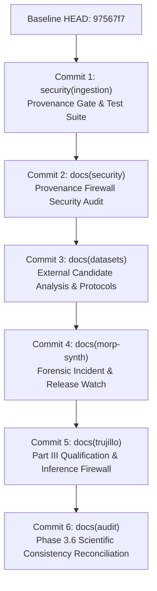

# Phase 3.6B Disciplined Commit Architecture & Scope Audit Plan

**Document Date:** 2026-09-10  
**Authority:** Chief AI Officer (CAO) Mandate — Phase 3.6B  
**Operating Agent:** Ocean Sentinel Repository Integration Architect & Source-Control Planning Agent  
**Baseline Git HEAD:** `97567f712684a011a6849c6bc0af7b6c561bef1e`  
**Active Branch:** `master`  
**Status:** **PLANNING ONLY — STRICTLY ZERO COMMITS EXECUTED**  

---

## 1. Executive Summary & Audit Context

The Ocean Sentinel repository previously executed Commits 1 through 10 as specified in the original `experiments/REPOSITORY_COMMIT_PLAN.md`, culminating at commit `97567f7` (*"docs(audit): document repository hygiene and commit architecture forensic audits"*). 

Subsequent work across Phases 3.1 through 3.6A addressed:
- Phase 3.1: Two-track external validation protocol and baseline reconciliation.
- Phase 3.2: QPOSD provenance failure, immediate abort, forensic capture, and cleanup.
- Phase 3.2B/C/D: Exhaustive candidate matrix and MORP-Synth release watch.
- Phase 3.4: Trujillo Part III preflight, Zenodo rate-limit abort, and frozen inference firewall.
- Phase 3.5: Hardened pre-download provenance gate, state machine, and resumability test suite.
- Phase 3.6A: Historical scientific consistency reconciliation across documentation.

As a result, exactly 30 untracked files currently reside in the repository. To avoid a monolithic, undisciplined commit, this plan establishes a **6-commit modular architecture**. Each commit has one coherent purpose, preserves historical evidence, and maintains verified scientific boundaries.

---

## 2. Complete Pending File Inventory & Epistemic Classification

| # | File Path | Category Classification | Origin Phase | Purpose | Reproducible | Proposed Commit Disposition |
|---|---|:---:|:---:|---|:---:|---|
| 1 | `src/ocean_sentinel/ingestion/provenance_gate.py` | A. SECURITY IMPLEMENTATION | Phase 3.5 | Authoritative provenance gate, state machine, token manager | Yes (Code) | **COMMIT 1** (`security(ingestion)`) |
| 2 | `tests/test_provenance_gate.py` | B. SECURITY TEST | Phase 3.5 | 17 adversarial & regression tests for provenance gate | Yes (Code) | **COMMIT 1** (`security(ingestion)`) |
| 3 | `tests/test_acquisition_resumability.py` | B. SECURITY TEST | Phase 3.5 | 5 resumability and interruption safety unit tests | Yes (Code) | **COMMIT 1** (`security(ingestion)`) |
| 4 | `experiments/PROVENANCE_FIREWALL_SECURITY_AUDIT_20260909.md` | C. SECURITY AUDIT | Phase 3.5 | Security audit report and zero-byte proof documentation | Yes (Doc) | **COMMIT 2** (`docs(security)`) |
| 5 | `experiments/EXTERNAL_VALIDATION_READINESS.md` | D. SCIENTIFIC DATASET AUDIT | Phase 3.1 | Two-track external validation protocol and baseline lock | Yes (Doc) | **COMMIT 3** (`docs(datasets)`) |
| 6 | `experiments/EXTERNAL_DATASET_CANDIDATE_MATRIX_20260909.md` | D. SCIENTIFIC DATASET AUDIT | Phase 3.2C-R | Multi-candidate evaluation matrix across international SAR | Yes (Doc) | **COMMIT 3** (`docs(datasets)`) |
| 7 | `experiments/EXTERNAL_DATASET_CANDIDATE_DEEP_VERIFICATION_20260909.md` | D. SCIENTIFIC DATASET AUDIT | Phase 3.2D | In-depth verification of DARTIS, Trujillo, CleanSeaNet | Yes (Doc) | **COMMIT 3** (`docs(datasets)`) |
| 8 | `experiments/DATASET_PREFLIGHT_MORP_SYNTH.json` | E. EXPERIMENT RECORD / SPEC | Phase 3.2R | Preflight specification and rejection criteria for MORP-Synth | Yes (JSON) | **COMMIT 4** (`docs(morp-synth)`) |
| 9 | `experiments/MORP_SYNTH_ACQUISITION_BLOCKED_20260909.md` | I. HISTORICAL ARTIFACT | Phase 3.2 | Forensic incident audit of QPOSD abort and cleanup | Yes (Doc) | **COMMIT 4** (`docs(morp-synth)`) |
| 10 | `experiments/MORP_SYNTH_PROVENANCE_GATE_REMEDIATION_20260909.md` | C. SECURITY AUDIT | Phase 3.2R | Remediation report for provenance gate implementation | Yes (Doc) | **COMMIT 4** (`docs(morp-synth)`) |
| 11 | `experiments/MORP_SYNTH_PROVENANCE_RESOLUTION_20260909.md` | D. SCIENTIFIC DATASET AUDIT | Phase 3.2B | Provenance resolution proving MORP-Synth release unresolved | Yes (Doc) | **COMMIT 4** (`docs(morp-synth)`) |
| 12 | `experiments/MORP_SYNTH_RELEASE_WATCH_20260909.md` | D. SCIENTIFIC DATASET AUDIT | Phase 3.2C | Monitoring protocol for author repositories and preprint | Yes (Doc) | **COMMIT 4** (`docs(morp-synth)`) |
| 13 | `experiments/DATASET_MANIFEST_TRUJILLO_PART_III.json` | E. EXPERIMENT RECORD / SPEC | Phase 3.4 | Preflight manifest for Part III documenting network block | Yes (JSON) | **COMMIT 5** (`docs(trujillo)`) |
| 14 | `experiments/TRUJILLO_PART_III_PHYSICAL_QUALIFICATION_20260909.md` | D. SCIENTIFIC DATASET AUDIT | Phase 3.4 | Physical qualification report documenting HTTP 403 halt | Yes (Doc) | **COMMIT 5** (`docs(trujillo)`) |
| 15 | `experiments/TRUJILLO_PART_III_FROZEN_EVALUATION_20260909.md` | E. EXPERIMENT RECORD | Phase 3.4 | Evaluation report enforcing frozen inference firewall (0 runs) | Yes (Doc) | **COMMIT 5** (`docs(trujillo)`) |
| 16 | `experiments/PHASE_3_6A_CONSISTENCY_CLEANUP_20260910.md` | C. SECURITY AUDIT / HYGIENE | Phase 3.6A | Scientific consistency cleanup audit report | Yes (Doc) | **COMMIT 6** (`docs(audit)`) |
| 17 | `experiments/REPOSITORY_COMMIT_PLAN_20260910.md` | C. AUDIT / INTEGRATION PLAN | Phase 3.6B | This modular commit architecture plan | Yes (Doc) | **COMMIT 6** (`docs(audit)`) |
| 18 | `uv.lock` | J. OTHER (ENVIRONMENT LOCKFILE) | Environment | Lockfile generated during local Python environment config | Yes (Lock) | **REQUIRES_CAO_REVIEW** / **REMAIN_UNTRACKED** |
| 19 | `experiments/.../exp01_interrupted_.../best_model.pt` | H. MODEL CHECKPOINT | Phase 2 | Historical interrupted baseline weights (278.91 MB) | Binary | **REMAIN_UNTRACKED** (Binary Firewall) |
| 20 | `experiments/exp01_baseline/best_model.pt` | H. MODEL CHECKPOINT | Phase 2 | Certified EXP-01 baseline weights (278.92 MB) | Binary | **REMAIN_UNTRACKED** (Binary Firewall) |
| 21 | `experiments/exp01_baseline/final_model.pt` | H. MODEL CHECKPOINT | Phase 2 | EXP-01 final epoch weights (278.92 MB) | Binary | **REMAIN_UNTRACKED** (Binary Firewall) |
| 22 | `experiments/exp01_baseline/latest_checkpoint.pt` | H. MODEL CHECKPOINT | Phase 2 | EXP-01 optimizer/resume state (278.92 MB) | Binary | **REMAIN_UNTRACKED** (Binary Firewall) |
| 23 | `experiments/.../exp02b_1_.../best_model.pt` | H. MODEL CHECKPOINT | Phase 2 | EXP-02B-1 candidate weights (278.91 MB) | Binary | **REMAIN_UNTRACKED** (Binary Firewall) |
| 24 | `experiments/.../exp02b_1_.../final_model.pt` | H. MODEL CHECKPOINT | Phase 2 | EXP-02B-1 final epoch weights (278.92 MB) | Binary | **REMAIN_UNTRACKED** (Binary Firewall) |
| 25 | `experiments/.../exp02b_1_.../latest_checkpoint.pt` | H. MODEL CHECKPOINT | Phase 2 | EXP-02B-1 optimizer state (278.92 MB) | Binary | **REMAIN_UNTRACKED** (Binary Firewall) |
| 26 | `experiments/.../exp02c_.../best_model.pt` | H. MODEL CHECKPOINT | Phase 2 | Certified EXP-02C production weights (278.92 MB) | Binary | **REMAIN_UNTRACKED** (Binary Firewall) |
| 27 | `experiments/.../exp02c_.../final_model.pt` | H. MODEL CHECKPOINT | Phase 2 | EXP-02C final epoch weights (278.92 MB) | Binary | **REMAIN_UNTRACKED** (Binary Firewall) |
| 28 | `experiments/.../exp02c_.../latest_checkpoint.pt` | H. MODEL CHECKPOINT | Phase 2 | EXP-02C optimizer/resume state (278.93 MB) | Binary | **REMAIN_UNTRACKED** (Binary Firewall) |
| 29 | `experiments/.../exp02c_.../remote_training_output/best_model.pt` | H. MODEL CHECKPOINT | Phase 2 | Duplicate cloud download weights (278.92 MB) | Binary | **REMAIN_UNTRACKED** (Binary Firewall) |
| 30 | `experiments/.../exp02c_.../remote_training_output/final_model.pt` | H. MODEL CHECKPOINT | Phase 2 | Duplicate cloud download weights (278.92 MB) | Binary | **REMAIN_UNTRACKED** (Binary Firewall) |
| 31 | `experiments/.../exp02c_.../remote_training_output/latest_checkpoint.pt` | H. MODEL CHECKPOINT | Phase 2 | Duplicate cloud download optimizer (278.93 MB) | Binary | **REMAIN_UNTRACKED** (Binary Firewall) |
| — | `scratch/trujillo_part_iii_qualification_state.json` | F. RUNTIME STATE | Phase 3.6A | Local runtime state recording Part III network block | Local State | **REMAIN_UNTRACKED** (Ignored in scratch/) |
| — | `scratch/morp_synth_qualification_state.json` | F. RUNTIME STATE | Phase 3.6A | Local runtime state recording MORP-Synth blocked status | Local State | **REMAIN_UNTRACKED** (Ignored in scratch/) |

---

## 3. Disciplined Modular Commit Architecture

### COMMIT 1: Core Security Implementation & Adversarial Test Suite
* **Commit Message**: `security(ingestion): implement pre-download provenance firewall and resumability safeguards`
* **Purpose**: Enforces the non-negotiable architectural invariant that authoritative provenance must pass before any network stream or local file handle is opened. Implements cryptographic token issuance (`VerifiedProvenanceToken`), qualification state machine (`DatasetQualificationStateMachine`), transfer layer (`DatasetTransferManager`), and path traversal defense.
* **Exact Files (3 files)**:
  - `src/ocean_sentinel/ingestion/provenance_gate.py`
  - `tests/test_provenance_gate.py`
  - `tests/test_acquisition_resumability.py`
* **Package Integration Decision**: `src/ocean_sentinel/ingestion/__init__.py` is intentionally excluded from this commit because repository callers import directly from `ocean_sentinel.ingestion.provenance_gate` and re-exporting is not required by package consumers.
* **Dependencies**: Baseline `97567f7`
* **Validation**: Run `python -m pytest tests/test_provenance_gate.py tests/test_acquisition_resumability.py -v` (22/22 pass).

---

### COMMIT 2: Provenance Firewall Security Audit & Zero-Byte Certification
* **Commit Message**: `docs(security): record provenance firewall security audit and zero-byte verification`
* **Purpose**: Records the comprehensive security audit certifying fail-closed state transitions, cryptographic HMAC integrity, stale-token rejection, Content-Length truncation defense, path traversal prevention, and empirical zero-byte network proofs.
* **Exact Files (1 file)**:
  - `experiments/PROVENANCE_FIREWALL_SECURITY_AUDIT_20260909.md`
* **Dependencies**: Commit 1
* **Rationale**: Separates extensive security compliance documentation from pure source code, facilitating clean code review.

---

### COMMIT 3: External Validation Protocols & Candidate Dataset Matrix
* **Commit Message**: `docs(datasets): establish two-track external validation protocol and candidate benchmark matrix`
* **Purpose**: Formalizes the two-track validation protocol (Track A: Look-alike false-alarm robustness vs. Track B: Pixel-level segmentation generalization), provides the disentangled multi-candidate evaluation matrix across international SAR datasets, and records in-depth qualification criteria.
* **Exact Files (3 files)**:
  - `experiments/EXTERNAL_VALIDATION_READINESS.md`
  - `experiments/EXTERNAL_DATASET_CANDIDATE_MATRIX_20260909.md`
  - `experiments/EXTERNAL_DATASET_CANDIDATE_DEEP_VERIFICATION_20260909.md`
* **Dependencies**: Commit 2
* **Rationale**: Consolidates dataset selection, candidate evaluations, and protocol criteria into a cohesive scientific unit.

---

### COMMIT 4: MORP-Synth Incident Forensics, Provenance Resolution, & Release Watch
* **Commit Message**: `docs(morp-synth): record QPOSD incident forensics, provenance resolution, and release watch`
* **Purpose**: Preserves transparent forensic records of the historical QPOSD acquisition abort incident, documents the authoritative cross-source resolution confirming that public release of MORP-Synth is unresolved (`arXiv:2512.02290v1`), records the machine-readable preflight contract, and establishes the release watch protocol.
* **Exact Files (5 files)**:
  - `experiments/DATASET_PREFLIGHT_MORP_SYNTH.json`
  - `experiments/MORP_SYNTH_ACQUISITION_BLOCKED_20260909.md`
  - `experiments/MORP_SYNTH_PROVENANCE_GATE_REMEDIATION_20260909.md`
  - `experiments/MORP_SYNTH_PROVENANCE_RESOLUTION_20260909.md`
  - `experiments/MORP_SYNTH_RELEASE_WATCH_20260909.md`
* **Dependencies**: Commit 3
* **Rationale**: Isolates the MORP-Synth narrative, failure history, and watch protocols into a single, uncompromised historical provenance record.

---

### COMMIT 5: Trujillo Part III Physical Qualification Halt & Frozen Inference Firewall
* **Commit Message**: `docs(trujillo): record Part III physical qualification halt and frozen inference firewall`
* **Purpose**: Records the acquisition preflight for Trujillo Part III (`10.5281/zenodo.13761290`), documents the network access failure resulting from Zenodo HTTP 403 rate limiting with zero bytes transferred, and certifies that the frozen inference firewall prevented unverified evaluation (exactly 0 model forward passes).
* **Exact Files (3 files)**:
  - `experiments/DATASET_MANIFEST_TRUJILLO_PART_III.json`
  - `experiments/TRUJILLO_PART_III_PHYSICAL_QUALIFICATION_20260909.md`
  - `experiments/TRUJILLO_PART_III_FROZEN_EVALUATION_20260909.md`
* **Dependencies**: Commit 4
* **Rationale**: Distinct scientific package documenting the same-family held-out test set qualification attempt.

---

### COMMIT 6: Scientific Consistency Reconciliation & Commit Architecture Audit
* **Commit Message**: `docs(audit): document Phase 3.6 scientific consistency reconciliation and commit architecture`
* **Purpose**: Records the Phase 3.6A forensic audit reconciling historical document inconsistencies (Part III role, volume, geography, Git terminology) and documents the disciplined Phase 3.6B commit plan.
* **Exact Files (2 files)**:
  - `experiments/PHASE_3_6A_CONSISTENCY_CLEANUP_20260910.md`
  - `experiments/REPOSITORY_COMMIT_PLAN_20260910.md`
* **Dependencies**: Commit 5
* **Rationale**: Closes the audit cycle with meta-audit documentation certifying repository integrity.

---

## 4. Checkpoint & Scratch Quarantine Policy

1. **Large Model Checkpoints (`*.pt`)**:
   - All 13 binary checkpoint files (totaling ~3.62 GB) MUST remain untracked outside Git.
   - Verified that no `.pt` file is required for code execution, unit tests, or documentation.
   - Checkpoint integrity is independently governed via certified SHA-256 hashes (`scratch/verify_all_frozen_hashes.py`).
2. **Scratch Runtime State**:
   - `scratch/trujillo_part_iii_qualification_state.json` and `scratch/morp_synth_qualification_state.json` reside in `scratch/`, which is ignored by `.gitignore`. They are transient operational state and must remain uncommitted.
3. **Environment Lockfile (`uv.lock`)**:
   - `uv.lock` is an ephemeral artifact of local environment probing. It must remain untracked unless the CAO formally mandates migration of the project package manager.

---

## 5. Summary Commit Target Matrix

| Target Group | Proposed Commit Identifier | File Count | Core Review Focus |
|---|---|:---:|---|
| **COMMIT 1** | `security(ingestion)` | 3 | Core security code, HMAC token logic, 22 unit tests |
| **COMMIT 2** | `docs(security)` | 1 | Formal firewall audit and zero-byte proof report |
| **COMMIT 3** | `docs(datasets)` | 3 | Validation protocol, candidate matrix, deep verification |
| **COMMIT 4** | `docs(morp-synth)` | 5 | Incident forensics, resolution report, release watch |
| **COMMIT 5** | `docs(trujillo)` | 3 | Part III preflight manifest, qualification report, firewall |
| **COMMIT 6** | `docs(audit)` | 2 | Phase 3.6A cleanup audit & Phase 3.6B commit architecture |
| **REMAIN_UNTRACKED** | Quarantined / Ignored | 15 | 13 `.pt` checkpoints, `uv.lock`, scratch state files |
| **Total Pending Entries** | | **32** | |
